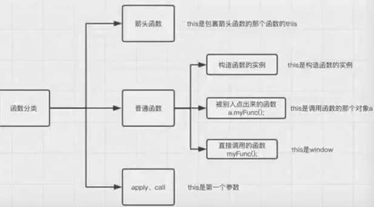

## 作用域 闭包 this 指针

### 专业术语

- 常量、变量、数据类型

- 形参、实参

- 匿名函数、具名函数、自执行函数

- 函数声明、函数表达式

- 堆、栈

- 同步、异步、进程、线程

### 执行上下文

当函数执行时, 会创建一个称为上下文 (execution context) 的环境, 分为创建和执行2个阶段.

#### 创建阶段

创建阶段, 指函数被调用但还未执行任何代码时, 此时创建了一个拥有3个属性的对象:

```js
exectionContext = {
    scopeChain: {}, // 创建作用域链 (scope chain)
    variableObject: {}, // 初始化变量、函数、形参
    this: {} // 指定this
}
```

#### 代码执行阶段

代码执行阶段主要的工作是: 1、分配变量、函数的引用, 赋值. 2、执行代码.

**举个栗子**

```js
// 一段这样的代码
function demo(num) {
    var name = 'xiaowa';
    var getData = function getData() {};
    function c() {}
}
demo(100);

// 创建阶段大致这样, 在这个阶段就出现了[变量提升(Hoisting)]
executionContext = {
    scopeChain: { ... },
    variableObject: {
        arguments: { // 创建了参数对象
            0: 100,
            length: 1
        },
        num: 100, // 创建形参名称, 赋值/或创建引用拷贝
        c: pointer to function c(), // 有内部函数声明的话, 创建引用指向函数体
        name: undefined, // 有内部声明变量a, 初始化为 undefined
        getData: undefined // 有内部声明变量b, 初始化为 undefined
    },
    this: { ... }
}

// 代码执行阶段, 在这个阶段主要是赋值并执行代码
executionContext = {
    scopeChain: { ... },
    variableObject: {
        arguments: {
            0: 100,
            length: 1
        },
        num: 100,
        c: pointer to function c(),
        name: 'xiaowa',
        getData: pointer to function getData()
    },
    this: { ... }
}
```

#### 执行上下文栈

- 浏览器中的 JS 解释器是单线程的, 相当于浏览器中同一时间只能做一个事情.

- 代码中只有一个全局执行上下文, 和无数个函数执行上下文, 这些组成了执行上下文栈 (Execution Stack).

- 一个函数的执行上下文, 在函数执行完毕后, 会被移出执行上下文栈.

**举个栗子**

```js
function c() {
    console.log('ok');
}
function a() {
    function b() {
        c();
    }
    b();
}
a();
```

这个栗子的执行上下文栈是这样的


### 作用域

### 作用域链

### 闭包

高级程序设计三中: 闭包是指有权访问另一个函数作用域中的变量的函数, 可以理解为(能够读取其他函数内部变量的函数)

wiki 百科的解释: [https://en.wikipedia.org/wiki/Closure_(computer_programming)](https://en.wikipedia.org/wiki/Closure_(computer_programming))

In programming languages, a closure, also lexical closure or function closure, is a technique for implementing lexically scoped name binding in a language with first-class functions. Operationally, a closure is a record storing a functiona together with an environment.1 The environment is a mapping associating each free variable of the function (variables that are used locally, but defined in an enclosing scope) with the value or reference to which the name was bound when the closure was created.b Unlike a plain function, a closure allows the function to access those captured variables through the closure's copies of their values or references, even when the function is invoked outside their scope.

```js
function outer() {
    var top = xxxx;
    function inner() {
        xxx.innerHTML = top;
    }
}
```

**平时用在哪儿?**

1、封装私有变量 (amd 的框架等都使用)

```js
/* demo */
var Person = function () {
    // 静态私有变量(静态!!)
    var _money = 100;

    function Person() {
        // 公有变量
    }

    Person.prototype.buy = function () {
        _money -= 10;
        console.log('left money::', _money);
    };
    return Person;
}();

/* 会引发的问题 */
var person = new Person();
!function () {
    person._money = 0;
}();
person.buy();

var person2 = new Person();
person2.buy();

/* 实际生产中可能会引发问题的demo: AMD规范 */
define('Person', function () {
    var _money = 100;

    function Person() {

    }

    Person.prototype = {
        buy: function () {
            _money -= 10;
            console.log('left money::', _money);
        }
    };
    return Person;
});
var Person = require('Person');
```

2、存储变量

```js
!function () {
    var axios = require('axios');

    /* 封装了一个数据接口 */
    function apiGenerator() {
        var menuData = null;
        return function getInitMenu() {
            if (menuData) return Promise.resolve(menuData);
            return axios.get('menuapi')
                .then(resp => {
                    menuData = resp;
                    return menuData;
                })
        }
    }

    var getInitMenu = apiGenerator();

    class App extends React.Component {
        constructor() {
            super();
            getInitMenu().then(res => {

            });
        }

        onClick() {
            getInitMenu().then(res => {

            });
        }
    }
}();
```

### this

一共有5种场景.

#### 场景1: 函数直接调用时

```js
function myfunc() {
    console.log(this); // this 是 window
}
var a = 1;
myfunc();
```

#### 场景2: 函数被别人调用时

```js
function myfunc() {
    console.log(this); // this 是对象 a
}
var a = {
    myfunc: myfunc
};
a.myfunc();
```

#### 场景3: new 一个实例时

```js
function Person(name) {
    this.name = name;
    console.log(this); // this 是指实例 p
}

var p = new Person('zhaowa');
```

#### 场景4: apply、call、bind时

```js
function getColor(color) {
    this.color = color;
    console.log(this);
}

function Car(name, color) {
    this.name = name; // this 指的是实例 car
    getColor.call(this, color); // 这里的 this 从原本的 getColor, 变成了 car
}

var car = new Car('卡车', '绿色');
```

#### 场景5: 箭头函数时

```js
// 复习一下场景1
var a = {
    myfunc: function () {
        setTimeout(function () {
            console.log(this); // this 是 a
        }, 0)
    }
};
a.myfunc();

// 稍微改变一下
var a = {
    myfunc: function () {
        var that = this;
        setTimeout(function () {
            console.log(that); // this 是 a
        }, 0)
    }
};
a.myfunc();

// 箭头函数
var a = {
    myfunc: function () {
        setTimeout(() => {
            console.log(this); // this 是 a
        })
    }
};
a.myfunc();
```

**总结一下**



1、对于直接调用的函数来说, 不管函数被放在了什么地方, this 都是 window

2、对于被别人调用的函数来说, 被谁点出来的, this 就是谁

3、在构造函数中, 类中(函数体中)出现的`this.xxx = xxx`中的this是当前类的一个函数实例

4、call、apply时, this 是第一个参数, bind要优与 call/apply 哦, call 参数多, apply 参数少

5、箭头函数没有自己的 this, 需要看其外层的是否有函数, 如果有, 外层函数的 this 就是内部箭头函数的 this, 如果没有, 则 this 是 window
