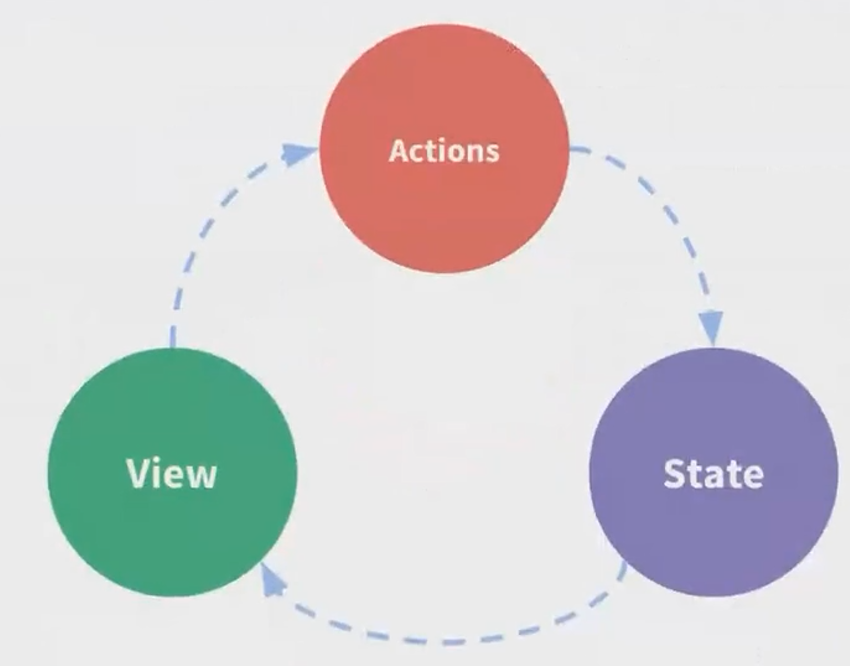
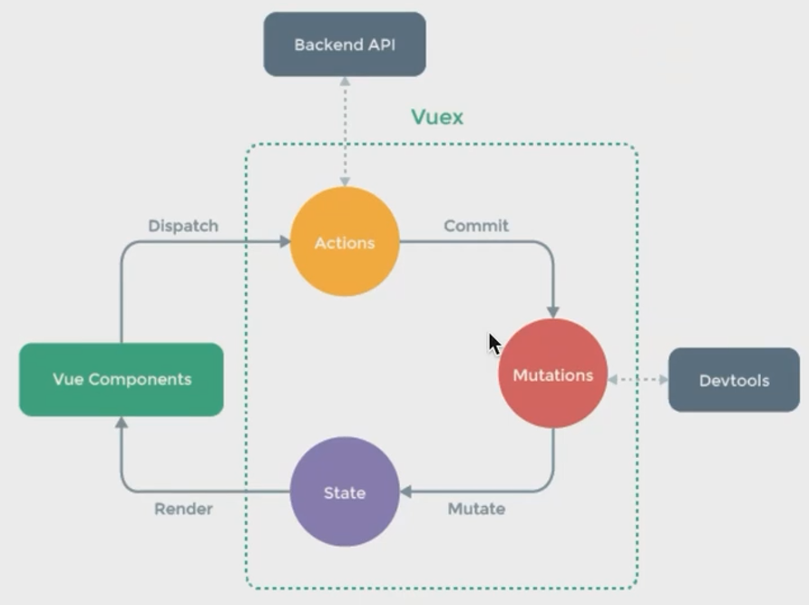

# vue.js 状态管理及 ssr (路由及状态同构)

## 前端状态管理出现的意义及解决的问题

随着前端应用的逐步复杂, 我们的组件中需要使用越来越多的状态. 有的时候我们需要使用子组件将状态传递给父组件就会比较复杂, 数据的向上传递过程我们可能会使用回调函数或是数据绑定的形式去处理, 就会让代码晦涩难懂.

(查看例子1)

我们需要一种方式, 能够让数据在所有组件中共享, 同时能以简单的方式进行传递, 这种组织数据的方式就是状态管理. 我们很自然地就想到, 把数据放到所有需要使用的组件的公共祖先上, 在使用时自上而下传递即可.

在 vue.js 中, 我们主要说的状态管理库就是 vuex, 当然, 只要你能实现有条理的组织数据, 那么它都可以认为是一种状态管理库.

事实上, 我们可以简单的这样理解「状态管理」这个词, vuex 实际上做的事情就是:

- 在顶层实现一个数据管理的仓库 store, 将所有组件间需要共享的数据放置于此

- 同时组件也可以对这个 store 内的数据进行更新, 同时更新完之后响应式更新所有使用此数据组件的视图

## vuex 介绍及深入使用

在说 vuex 之前, 我们必须说一说 flux 架构, flux 架构可谓是状态管理的鼻祖.

flux 架构最早由 facebook 推出, 主要是为了处理当时他们的 react 框架下状态管理的问题, 但在当时来讲, 整个设计比较复杂, 后来人们简化了其中的一些理念, 但是保留了核心思想, 继而依据框架实现了很多不同的状态管理库, 例如 redux, vuex 等等. 其中 redux 大多数被用在了 react 项目中, 而 vuex 就是在 vue 框架中实现的这么一个 flux 架构的状态管理库.

flux 架构约定, 存放数据的地方称为 store, store 内部的 state 是数据本身, 我们必须通过 action 才能修改 store 里的 state. 这里的 action 指的意思是行为, 在大部分实现里面是一个函数, 通过调用函数来更改 store 内部的 state.

vuex 中, 我们可以通过 mutation 来同步地改变 state, 这时候就可以在组件中通过 commit 进行调用更改 state.

(查看例子2)

同样的, 我们也可以通过 action 来异步更改 state, 不过在 action 中, 我们还是需要调用 mutation.

(查看例子3)

(查看例子4)

## vue.js 服务端渲染介绍

大多数我们使用的 UI 框架如 vue 和 react, 都是在客户端进行渲染, 也就是说每个用户在加载进来我们所有的 html 文件和 js 文件之后, 才开始渲染页面的内容.

但是这样做会有两个问题, 一个是如果用户网络速度比较慢, 如果我们渲染的内容比较多的话, 就会产生一个延迟, 造成不好的用户体验. 另一个是某些爬虫, 例如百度的搜索收录的爬虫, 在爬取你的页面时, 获取不到你的页面的真实内容, 导致站点 SEO 权重变低.

所以很多需要 SEO 的页面, 都需要在服务端提前渲染好 html 的内容, 在用户访问时先返回给用户内容, 这样对用户和爬虫都非常友好.

(查看例子1)

我们可以通过直接在页面上右击查看网页源代码, 来查看一个页面是否有服务端渲染.

### 详细代码可参见 仓库 folder 12
