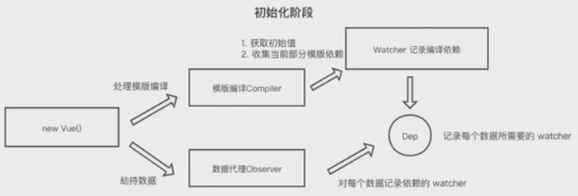
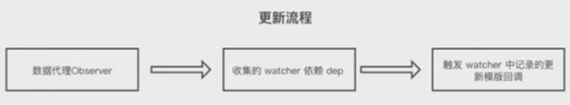

## Vue 源码解析

Vue 使用 Object.defineProperty + 观察者模式对数据和模板进行绑定, 对于数据来说需要进行更新时, 即会触发对应的 getter 和 setter 函数, 在 setter 函数中, 即可根据对应收集到的依赖, 触发对应视图层更新.

对于一次手机和一次更新来说, 大致流程如下:

- 实例化 Vue 之后, 对内部所有的 data 进行劫持
