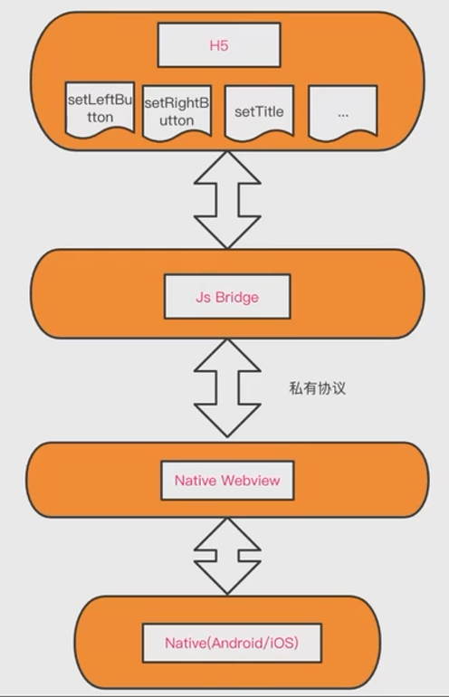

## 现代 Hybrid 开发与原理解析

开始之前, 咱们先来罗列一下当前市面上, 移动端的各种开发方式.

1. Native App

   > 纯原生的 app 开发模式, android 或者 ios.
   >
   > Java swift oc
   >
   > 优点: 有最好的性能, 最好的体验.
   >
   > 缺点: 开发和发布的成本极高, 两端需要不同的技术人员来维护, 原生开发人员非常的稀缺.

2. WebApp

   > 移动端运行在浏览器上的网站, 我们一般称之为 h5 应用, 就是泛指我们经常开发的 spa, mpa.
   >
   > js vue react ng jquery
   >
   > 优点:
   >
   > 1. 开发和发布非常方便
   > 2. 用户看到的页面, 会随着开发人员的发布实时更新
   > 3. 可以跨平台, 因为 h5 应用的产出其实就是一个 url, 调试非常的方便. chrome safari, f12
   > 4. 类似优点2, 不存在多版本的问题, 维护成本很低. 安卓 app 1.0.0 2.0.0
   >
   > 缺点:
   >
   > 1. 性能和体验一般
   > 2. 受限于浏览器, 能做的事情并不是很多, 需要兼容各种奇怪的浏览器
   > 3. 入口强依赖浏览器

3. React Native App / Weex App

   > 都是为了跨平台而生的, 支持 react/vue 的语法.

4. Flutter

   > 闲鱼.
   >
   > dart 语言, 跨平台支持的更好.

### Hybrid 基本介绍

混合开发.

h5 + native 混合开发 = hybrid

app -> webview -> url !== hybrid

最大的特点是 h5 和 native 可以双向交互.

#### 通过微信 JSSDK 介绍 Hybrid

h5 经常分享在微信聊天/朋友圈.

公众号文章 -> ... -> 分享给好友

授权 -> 是否同意授权 xxx -> 头像昵称 -> 手机号.

微信的 JSSDK [https://developers.weixin.qq.com/doc/offiaccount/OA_Web_Apps/JS-SDK.html#1](https://developers.weixin.qq.com/doc/offiaccount/OA_Web_Apps/JS-SDK.html#1)

分享、支付、位置. h5 开发者只需要关注微信 jssdk 中提供了哪些 api 即可, 其他的所有事情都由 jssdk 和微信客户端来完成.

```html
<script>xxxxxx</script>
```

**微信分享**

```js
wx.config({
    appId: 'xxxxxx'
});

wx.ready(() => {
    wx.onMenuShareAppMessage({
        title: '哈哈哈',
        desc,
        link,
        imgUrl
    });
});
```

### 现代 Hybrid 开发与原理解析

接下来咱们开始详细介绍一下 Hybrid 开发的架构, 最后会尝试实现一个 js 端的 bridge.

#### Hybrid 开发架构



所以说, hybrid 最核心的部分, 就是 native 和 h5 的双向通讯. 通讯是完全依赖于 webview 容器.

1. 具体的通讯形式又是什么样子的呢?
2. webview 凭什么可以支撑起 native 和 h5 的双向通讯.

双向通讯市面上目前有两种方式:

- URL schema, 客户端通过拦截 webview 中的请求来完成通讯
- native 向 webview 的 js 执行环境中, 给 window 对象挂载 api, 以此来完成通讯

##### 一、URL Schema, 客户端拦截 webview 请求

1. 原理

   在 webview 中发出的网络请求, 都会被客户端给监听到, 给拦截到.

   这就是 URL Schema 这种模式实现的最基本的基石.

2. 定义自己的私有协议

   h5 里面可能有无数的请求, [https://www.baidu.com](https://www.baidu.com). // http 协议

   native 可以定义自己的私有协议, qiuku://

   随后我们在 webview 中如果要去调用 native 的一些端能力, 就需要在请求前面拼上这个协议头, setTitle

   `qiuku://setTitle?params1=xxx&param2=xxx`

   协议的名称是自定义的, 没什么特别硬性的要求, 只要和 native 协商好就可以

   如果一家公司下有多个 app, 今日头条 抖音 西瓜视频, 比如有好多可以共用的逻辑, commonToutiao://

3. 请求的发送

   - iframe 的方式

     ```js
     const doc = window.document;
     const body = document.body;
   
     const iframe = doc.createElement('iframe');
     iframe.style.display = 'none';
     iframe.src = 'qiuku://setTitle?params1=xxx&param2=xxx'; // 此时还没有开始请求
     body.appendChild(iframe);
   
     setTimeout(() => {
         body.removeChild(iframe);
     }, 200);
     ```

     客户端要考虑的还有安全方面, 会设置一些域名的白名单.

     比如咱们 h5 现在的 url 是, www.qiuku.com, baidu.com

   - location.href

     不适用于并行的请求

4. 客户端拦截协议请求

   当拦截到的请求是`qiuku://`, 会解析参数, 解析方法, 进行相关的 native 操作.

5. 请求处理完成后的回调

   webview 请求本质上还是一个异步请求, 我们需要有一个回调来告诉我们请求的结果.

   `window.addEventListener`和`window.dispatchEvent`这两个 api.

   业务中:

   ```js
   window.setTitle({title: '哈哈哈哈', (err, response) => {
       if (err) {
           console.log(err);
           return;
       }
       // 执行成功, 执行业务逻辑
   }});
   ```

   JSBridge中:

   ```js
   let handlerId = 1;
   
   const eventName = `setTitle_${handlerId}`; // 每一个 eventName 唯一
   handlerId++;
   const event = new Event(eventName, (res) => {
       if (res.data.errcode) {
           // 执行失败
           return;
       }
       // 执行成功
   });
   
   JSBridge.send('qiuku://setTitile?title=哈哈哈哈'); // 相当于调用上面的 iframe
   
   event.data = {
       errcode: 0
   };
   window.dispatchEvent(event);
   ```

##### 二、注入 API

通过 iframe 来发送请求, 参数很容易过长而被截断. // iframe 为了兼容 iOS 6

1. 向 native 传递信息

   前提是: native 已经向 window 变量注入了各种 api, 咱们已经可以直接调用它们了.

   比如 `window.QiukuWebview = { setTitle: xxx };`

   ```js
   window.QiukuWebview.setTitle(params);
   ```

2. 准备接收 native 的回调

   ```js
   window['setTitle_callback_1'] = (errcode, response) => {
       console.log(errcode);
   }
   ```

   有可能有的公司为了安全性, 会对参数进行加密或者编码

3. native 调用回调函数

   native 执行完之后, 应该怎么告诉 h5 我执行完了呢? 我应该调用哪个函数告诉 h5 呢?
   
   ```js
   window.QiukuWebview.setTitle(params);
   ```
   
   ```js
   const callbackName = 'setTitle_callback_1';
   window.QiukuWebview.setTitle({
       trigger: callbackName,
       ...params
   });
   
   window['setTitle_callback_1'] = (errcode, response) => {
       console.log(errcode);
   }
   ```
   
   为了保证 callback 的唯一性, 一般会加入各种的`Date.now() + id`
   
   iOS `window.webkit.messageHandler.postMessage()`

```ts
declare var require: any;

const Buffer = require('buffer').Buffer;

interface WebviewParams {
    callback?: Function;

    [key: string]: any;
}

const UID_PREFIX = Date.now().toString();
const isNotApp = !/Qiuku/.test(window.navigator.userAgent);
let uid = 1;

// webkit.messageHandler
// postMessage

class Webview {
    public exec(name: string, params: WebviewParams) {
        this.addApi(name)[name](params);
    }

    /**
     * 一般用于处理一些后期的更新或者变动
     * 比如最初内置了好多 api, 但是后期客户端增加了好多 api
     * @param name
     */
    public addApi(name: string) {
        if (!this[name]) {
            this[name] = (params) => {
                if (isNotApp) {
                    return this;
                }
                return this.run(name, params);
            }
        }
    }

    private getUid(name: string) {
        return name + UID_PREFIX + (++uid);
    }

    private run(apiName: string, params: WebviewParams = {}) {
        const callback = params.callback;
        if (typeof callback === 'function') {
            // @ts-ignore
            const callbackName = this.getUid(callback.name);

            // 在 window 上注册的回调函数, 需要是接收 base64String 的函数
            window[callbackName] = this.convertToReceiveBase64(callback);

            params.trigger = callback;
        }

        let messageHandler = window['QiukuWebview'] as any;

        if (!messageHandler[apiName]) {
            console.error(`without ${apiName}, warning!!!`);
            return;
        }

        const encodeParams = new Buffer(JSON.stringify(params)).toString('base64');

        messageHandler[apiName](encodeParams);

        // 为了链式调用
        return this;
    }

    /**
     * 使用和客户端约定好的规则来解析 base64
     * @param base64Str
     * @private
     */
    private base64ToString(base64Str: string): string {
        const newStr = base64Str.replace(/[-_]/g, function (m0) {
            return m0 === '-' ? '+' : '/';
        }).replace(/[^A-Za-z0-9+/]/g, '');

        return (new Buffer(base64Str, 'base64')).toString();
    }

    /**
     * 解析 base64 的数据
     * @param callback
     * @private
     */
    private convertToReceiveBase64(callback: Function) {
        return (base64Str) => {
            let data = {};
            if (base64Str) {
                try {
                    data = JSON.parse(this.base64ToString(base64Str));
                } catch (e) {
                    const msg = e.message || 'webview parse error';
                    data = {msg};
                }
            }
            // apply 的第一个参数如果是 null, 代表将是执行环境的全局变量来执行 callback
            // window.callback(data);
            callback.apply(null, data);
        }
    }
}

const webview = new Webview();
webview.exec('setTitle', {
    title: '这是标题',
    callback: (errcode) => {
        console.log(errcode);
    }
});
```

### h5 在 app 内的运行方式

1. app 的 webview 直接加载一个 h5 链接

   > 缺点: 没有太好的体验, 除了能用一些 native 的能力之外, 和普通浏览器打开 h5 没什么区别
   >
   > 因为加载的还是网络资源
   >
   > 优点: 灵活, 易用

2. app 内置 h5 资源

   > 优点:
   >
   > - 首屏加载速度特别快, 体验接近原生
   >
   > - 可以不依赖网络, 离线运行
   >
   > 缺点:
   >
   > - 会增大 app 的体积
   > - 需要多方合作去完成方案
   >
   > 要解决的最核心的问题是: 如何更新内置的 h5 资源
   >
   > project-config.json
   >
   > 项目名、版本号、全量/增量更新、cdn 地址
   >
   > qiuku 1.2.0 全量 https://qiuku.cdn.com/1.2.0.js

### 开发中的常见问题

1. iOS webview 中滑动不流畅

   如果有一个滚动容器 scroll-container, overflow: scroll

   ```css
   -webkit-overflow-scrolling: touch; /* 当手指从触摸屏上移开，会保持一段时间的滚动 */
   -webkit-overflow-scrolling: auto; /* 当手指从触摸屏上移开，滚动会立即停止 */
   ```

2. 滚动穿透

   背景页面有滚动的时候, 此时有个弹窗出现了.

   2.1 弹窗内无滚动, 背景页面有滚动

   直接在弹窗容器元素上加一个监听事件就可以了

   ```js
   /* 原生 */
   document.addEventListener('touchmove', function (e) {
       // 阻止默认事件
       e.preventDefault();
   });
   
   /* vue */
   @touchmove.prevent
   ```

   2.2 弹窗内有滚动, 背景页面有滚动

   弹窗展示活动规则

   要实现的是:

   弹窗出现时, 背景禁止滚动

   弹窗隐藏时, 背景恢复滚动

   ```js
   /* vue 自定义指令, 仅适用于 v-if 组件, v-show 不适用 */
   const inserted = () => {
       // 弹窗出现时的行为
       const scrollTop = document.body.scrollTop || document.documentElement.scrollTop;
       document.body.style.cssText += `postion: fixed; width: 100%; top: -${scrollTop}px`;
   };
   
   const unbind = () => {
       const body = document.body || document.documentElement;
       body.style.position = '';
       const top = body.style.top;
       document.body.scrollTop = document.documentElement.scrollTop = -parseInt(top, 10);
       body.style.top = '';
   };
   
   export const vScroll = {
       inserted,
       unbind
   }
   
   Vue.directive('scroll', vScroll);
   
   div(v-scroll)
   ```

3. 刘海屏的安全区域留白

   设置 viewport-fit cover

   ```html
   <meta name="viewport" content="viewport-fix=over" />
   
   safe area inset
   ```

   ```css
   .bottom {
       position: fixed;
       bottom: 1rem;
       /* constant 写在 env 前面, 兼容性的问题 */
       bottom: calc(constant(safe-area-inset-bottom) + 1rem);
       bottom: calc(env(safe-area-inset-bottom) + 1rem);
   }
   ```

   