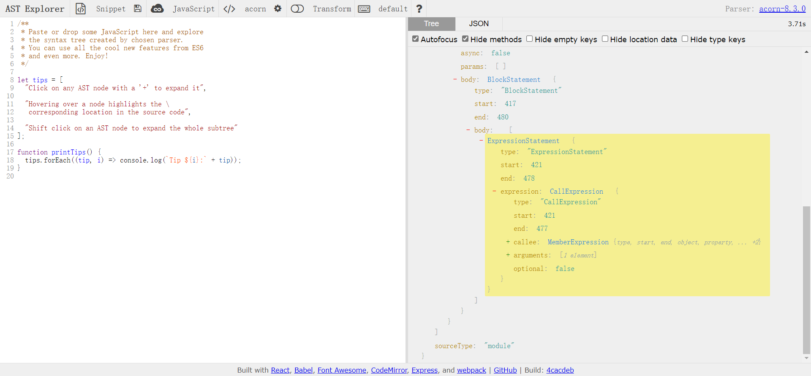

## AST 必知必会

### AST 背景

在计算机科学中, **抽象语法树**(**A**bstract **S**yntax **T**ree, AST), 是源代码语法结构的一种抽象表示.

它以树状的形式表现编程语言的语法结构, 树上的每个节点都表示源代码中的一种结构.

AST 运用广泛, 比如:

- 高级语言的编译、机器码的生成
- 一些高级编辑器的错误提示、代码高亮、代码自动补全
- 对于前端来说很多工具, 例如 `eslint`、`prettier` 对代码错误或风格的检查, babel、typescript 对代码的编译处理等等.

### AST 转化流程

我们可以实现一个非常简单的词法分析工具, 来感受一下词法分析的魅力, 以及这中间我们需要处理的内容.


在例子中我们可以发现, 我们通过读取字符串中每个元素, 依次记录里面出现的内容, 最终基于内容生成配置, 然后再基于配置创建新的代码的结构.

整个解析过程主要分为以下两个步骤:

- 分词: 将整个代码字符串分割成最小语法单元数组
- 语法分析: 在分词基础上建立分析语法单元之间的关系

词法分析器里, 每个关键字是一个 Token, 每个标识符是一个 Token, 每个操作符是一个 Token, 每个标点符号也都是一个 Token. 除此之外, 还会过滤掉源程序中的注释和空白字符(换行符、空格、制表符等等).

我们可以通过 ast-explore 来查看代码片段转化的结果:

[AST explorer](https://astexplorer.net/)



我们可以看到, 对于左侧的代码结构, 通过解析字符及对应的格式, 然后序列化成为一个对象的格式, 我们可以通过这个对象, 来描述整体的代码的内容.

如果我们希望将 let 转化为 var, 那后续我们只需要在基于配置渲染目标时, 将 let 转化为 var 生成即可.

对于 AST 的类型来说, 解析的过程中有这么多的类型, 针对不同的语句, 最终会以下面的类型进行转化:

```
ThisExpression | Identifier | Literal | ArrayExpression | ObjectExpression | FunctionExpression | ArrowFunctionExpression | ClassExpression | TaggedTemplateExpression | MemberExpression | Super | MetaProperty | NewExpression | CallExpression | UpdateExpression | AwaitExpression | UnaryExpression | BinaryExpression | LogicalExpression | ConditionalExpression | YieldExpression | AssignmentExpression | SequenceExpression
```

针对不同的工具, 最终也有不同的效果:

`@babel/parser`: 转化为 `AST` 抽象语法树;

`@babel/traverse`: 对 `AST` 节点进行递归遍历;

`@babel/types`: 对具体的 `AST` 节点进行修改;

`@babel/generator`: `AST` 抽象语法树生成为新的代码;

### index.js

```js
/**
 * 分词, 处理每个字符内容
 * @param {code} str 
 * @returns 
 */
function generateToken(str) {
    let current = 0;
    let tokens = [];
    while (current < str.length) {
        let char = str[current];
        if (char === "(") {
            tokens.push({
                type: "paren",
                value: "("
            });
            current++;
            continue;
        }
        if (char === ")") {
            tokens.push({
                type: "paren",
                value: ")"
            });
            current++;
            continue;
        }
        if (/\s/.test(char)) {
            current++;
            continue;
        }
        if (/[0-9]/.test(char)) {
            let numValue = "";
            while(/[0-9]/.test(char)) {
                numValue = numValue.concat(char);
                char = str[++current];
            }
            tokens.push({
                type: "number",
                value: numValue
            });
            continue;
        }
        if (/[a-zA-Z]/.test(char)) {
            let varValue = "";
            while(/[a-zA-Z]/.test(char)) {
                varValue = varValue.concat(char);
                char = str[++current];
            }
            tokens.push({
                type: "name",
                value: varValue
            });
            continue;
        }
        throw new TypeError("未能识别的字符");
    }
    return tokens;
}

/**
 * AST 生成
 * @param {*} tokens 
 * @returns 
 */
function generateAST(tokens) {
    let current = 0;

    let ast = {
        type: "Program",
        body: []
    };

    function walk() {
        let token = tokens[current];
        if (token.type === "number") {
            current++;
            return {
                type: "NumberLiteral",
                value: token.value
            };
        }
        if (token.type === "paren" && token.value === "(") {
            token = tokens[++current];
            let node = {
                type: "CallExpression",
                name: token.value,
                params: []
            };
            token = tokens[++current];
            while (
                (token.type !== "paren") || 
                (token.type === "paren" && token.value !== ")")) {
                    node.params.push(walk());
                    token = tokens[current];
            }
            current++;
            return node;
        }
        throw new TypeError(token.type);
    }

    while (current < tokens.length) {
        ast.body.push(walk());
    }

    return ast;
}

/**
 * AST 转化: babel 插件需要我们处理的部分
 * @param {*} ast 
 * @returns 
 */
function transformer(ast) {
    let newAst = {
        type: "Program",
        body: []
    };

    ast._context = newAst.body;

    DFS(ast, {
        NumberLiteral: {
            enter(node, parent) {
                parent._context.push({
                    type: "NumberLiteral",
                    value: node.value
                });
            }
        },
        CallExpression: {
            enter(node, parent) {
                let expression = {
                    type: "CallExpression",
                    callee: {
                        type: "Identifier",
                        name: node.name
                    },
                    arguments: []
                };

                node._context = expression.arguments;
                if (parent.type !== "CallExpression") {
                    expression = {
                        type: "ExpressionStatement",
                        expression: expression
                    };
                }
                parent._context.push(expression);
            }
        }
    });

    return newAst;
}

/**
 * AST 遍历
 * @param {*} ast 
 * @param {*} visitor 
 * @returns 
 */
function DFS(ast, visitor) {
    function traverseNode(node, parent) {
        let methods = visitor[node.type];
        if (methods && methods.enter) {
            methods.enter(node, parent);
        }
        switch(node.type) {
            case "Program": {
                traverseArray(node.body, node);
                break;
            }
            case "CallExpression": {
                traverseArray(node.params, node);
                break;
            }
            case "NumberLiteral": {
                break;
            }
        }
        if (methods && methods.exit) {
            methods.exit(node, parent);
        }
    }

    function traverseArray(children, parent) {
        children.forEach(child => traverseNode(child, parent));
    }

    return traverseNode(ast, null);
}

/**
 * AST -> code 生成代码过程
 * @param {*} ast 
 * @returns 
 */
function generate(ast) {
    switch (ast.type) {
        case "Program": {
            return ast.body.map(subAst => generate(subAst)).join("\n");
        }
        case "ExpressionStatement": {
            return generate(ast.expression) + ";";
        }
        case "CallExpression": {
            return generate(ast.callee) + "(" + ast.arguments.map(arg => generate(arg)).join(", ") + ")";
        }
        case "Identifier": {
            return ast.name;
        }
        case "NumberLiteral": {
            return ast.value;
        }
    }
}

function parser(input) {
    const tokens = generateToken(input);
    const ast = generateAST(tokens);

    const newAst = transformer(ast);
    const code = generate(newAst);
    return code;
}

module.exports = parser;
```

### test.js

```js
const parser = require('./index');
const input = "(add 2 (subtract 4 2))";
const output = "add(2, subtract(4, 2));";

console.log(parser(input) === output);
```


## babel 插件

### babel 的处理步骤

Babel 的三个主要处理步骤分别是: **解析(parse)**, **转换(transform)**, **生成(generator)**.

词法分析阶段把字符串形式的代码转换为**令牌(tokens)**流.

你可以把令牌看作是一个扁平的语法片段数组:

```
n * n;
[
	{ type: { ... }, value: "n", start: 0, end: 1, loc: { ... } },
	{ type: { ... }, value: "*", start: 1, end: 3, loc: { ... } },
	{ type: { ... }, value: "n", start: 4, end: 5, loc: { ... } },
	...
]
```

每一个 `type` 有一组属性来描述该令牌:

```json5
{
    type: {
        label: 'name',
        keyword: undefined,
        beforeExpr: false,
        startsExpr: true,
        rightAssociative: false,
        isLoop: false,
        isAssign: false,
        prefix: false,
        postfix: false,
        binop: null,
        updateContext: null
    },
    ...
}
```

和 AST 节点一样它们也有 `start`, `end`, `loc` 属性.

对于一个 babel 插件来说, 我们先从一个接收了当前 `babel` 对象作为参数的 `function` 开始.

```js
export default function(babel) {
    // plugin contents
}
```

由于你将会经常这样使用, 所以直接取出 `babel.types` 会更方便: (译注: 这是 ES2015 语法中的对象解构, 即 Destructuring).

```js
export default function({types: t}) {
    // plugin contents
}
```

接着返回一个对象, 其 `visitor` 属性是这个插件的主要访问者.

```js
export default function({types: t}) {
    return {
        visitor: {
            // visitor contents
        }
    };
}
```

Visitor 中的每个函数接收 2 个参数: `path` 和 `state`.

```js
export default function({types: t}) {
    return {
        visitor: {
            Identifier(path, state) {},
            ASTNodeTypeHere(path, state) {}
        }
    };
}
```

### 详细代码可参见 仓库 folder 39
