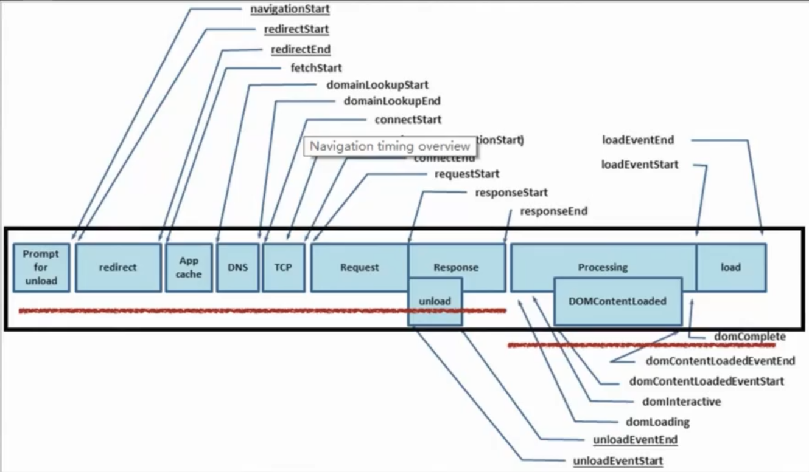

## 性能的计算方式

### 确认自己需要关注的指标

常见的指标有:

1. 页面总加载时间 load
2. 首屏时间
3. 白屏时间

业界比较关注的通用指标一般是页面总加载时间 和 白屏时间

window.performance.timing



### 各个属性所代表的含义

1. connectStart, connectEnd

   分别代表 TCP 建立连接和连接成功的时间节点. 如果浏览器没有进行 TCP 连接(比如使用持久化连接 websocket), 则两者都等于 domainLookupEnd;

   tcp 连接耗时 = connectEnd - connectStart

2. domComplete

   Html 文档完全解析完毕的时间节点;

3. domContentLoadedEventStart

   代表 DOMContentLoaded 事件触发的时间节点, 页面文档完全加载并解析完毕之后, 会触发 DOMContentLoaded 事件, HTML 文档不会等待样式文件, 图片文件, 子框架页面的加载(load 事件可以用来检测 HTML 页面是否完全加载完毕(full-loaded));

4. domContentLoadedEventEnd

   代表 DOMContentLoaded 事件完成的时间节点, 刺客用户可以对页面进行操作, 也就是 jQuery 中的 domready 时间;

5. domInteractive

   代表浏览器解析 html 文档的状态为 interactive 时的时间节点. domInteractive 并非 DOMReady, 它早于 DOMReady 触发, 代表 html 文档解析完毕(即 dom tree 创建完成)但是内嵌资源(比如外链 css、js 等)还未加载的时间点;

6. domLoading

   代表浏览器开始解析 html 文档的时间节点. 我们知道 IE 浏览器下的 document 有 readyState 属性, domLoading 的值就等于 readyState 改变为 loading 的时间节点;
   
7. domainLookupStart, domainLookupEnd

   分别代表 DNS 查询的开始和结束时间节点. 如果浏览器没有进行 DNS 查询(比如使用了 cache), 则两者的值都等于 fetchStart;

8. fetchStart

   是指浏览器发起任何请求之前的时间值. 在 fetchStart 和 domainLookupStart 之间, 浏览器会检查当前文档的缓存;

9. loadEventStart, loadEventEnd

   分别代表 onload 事件触发和结束的时间节点;

10. navigationStart

    浏览器最初加载页面的时间, 所有的时间指标都以此为基准;

11. redirectStart, redirectEnd

    如果页面是由 redirect 而来, 则 redirectStart 和 redirectEnd 分别代表 redirect 开始和结束的时间节点;

12. requestStart

    代表浏览器发起请求的时间节点, 请求的方式可以是请求服务器、缓存、本地资源等;

13. responseStart, responseEnd

    分别代表浏览器收到从服务器端(或缓存、本地资源)响应回的第一个字节和最后一个字节数据的时刻;

14. ecureConnectionStart

    可选. 如果页面使用 HTTPS, 它的值是安全连接握手之前的时刻. 如果该属性不可用, 则返回 undefined. 如果该属性可用, 但没有使用 HTTPS, 则返回 0;

15. unloadEventStart, unloadEventEnd

    如果前一个文档和请求的文档是同一个域的, 则 unloadEventStart 和 unloadEventEnd 分别代表浏览器 unload 前一个文档的开始和结束时间节点. 否则两者都等于 0.

### performance 具体计算

#### performance.ts

```typescript
import VueRouter from 'vue-router';
import {BaseTrack} from "./track";

export class Performance {
    public static readonly timing = window.performance && window.performance.timing;

    public static init(): void {
        window.addEventListener('load', () => {
            if (!Performance.timing) {
                console.log("当前浏览器不支持 Performance API");
                return;
            }

            // TODO 上报各种时间指标
            BaseTrack.track(Performance.getTimings());
        });
    }

    public static record(router?: VueRouter) {
        const setFPT = () => {
            if (window.performance && window.performance.now) {
                Performance.fpt = window.performance.now();
            }
        };
        return {
            created: () => {
                if (router) {
                    router.onReady(() => {
                        setFPT();
                    });
                } else {
                    setFPT();
                }
            }
        };
    }

    public static getTimings() {
        if (!Performance.timing) {
            console.warn("当前浏览器不支持 Performance API");
            return {};
        }
        return {
            redirect: Performance.getRedirectTiming(),
            dns: Performance.getDnsTiming(),
            tcp: Performance.getTcpTiming(),
            ttfb: Performance.getTimeOfFirstByte(),
            req: Performance.getRequestTiming(),
            ppdt: Performance.getParseDomTime(),
            dclt: Performance.getDomContentLoadTime(),
            fpt: Performance.getFirstPaintTime(),
            load: Performance.getLoadTime()
        };
    }

    private static fpt: number = 0;

    /**
     * 重定向耗时
     * @private
     */
    private static getRedirectTiming(): number {
        return Performance.timing.redirectEnd - Performance.timing.redirectStart;
    }

    /**
     * DNS查询耗时
     * @private
     */
    private static getDnsTiming(): number {
        return Performance.timing.domainLookupEnd - Performance.timing.domainLookupStart;
    }

    private static getTcpTiming(): number {
        return Performance.timing.connectEnd - Performance.timing.connectStart;
    }

    /**
     * 读取页面第一个字节耗时
     * @private
     */
    private static getTimeOfFirstByte(): number {
        return Performance.timing.responseStart - Performance.timing.navigationStart;
    }

    /**
     * request 请求耗时
     * @private
     */
    private static getRequestTiming(): number {
        /* 有待商榷 */
        return Performance.timing.responseEnd - Performance.timing.responseStart;
    }

    /**
     * 解析纯 dom 树的耗时(不包含 js css 等外链资源的加载与执行)
     * @private
     */
    private static getParseDomTime(): number {
        return Performance.timing.domInteractive - Performance.timing.domLoading;
    }

    /**
     * 页面资源的加载耗时
     * @private
     */
    private static getDomContentLoadTime(): number {
        return Performance.timing.domComplete - Performance.timing.domInteractive;
    }

    /**
     * 页面 load 总耗时
     * @private
     */
    private static getLoadTime(): number {
        return Performance.timing.loadEventStart - Performance.timing.navigationStart;
    }

    private static getFirstPaintTime(): number {
        return Math.round(window.performance.getEntriesByName('first-paint')
            && window.performance.getEntriesByName('first-paint')[0]?.startTime) || Performance.fpt;
    }
}
```

#### track.ts

```typescript
import queryString from 'query-string';
import { v4 as uuid } from 'uuid';

let image: HTMLImageElement | null;

export class BaseTrack {

    public static track(params: {[key: string]: any}) {
        try {
            const qs = queryString.stringify({
                timestamp: Date.now(),
                traceId: BaseTrack.getTraceId(),
                url: location.href,
                ...params,
            });
            BaseTrack.reportByImg(qs);
        } catch (e) {
            console.error(e);
        }
    }

    /**
     * tips 为什么上报的请求使用 .gif 图像请求
     * @private
     */
    private static serverUrl: string = "";

    private static reportByImg(qs: string, retryTimes: number = 3) {
        const retry = () => {
            image = null;
            if (retryTimes > 0) {
                BaseTrack.reportByImg(qs, retryTimes - 1);
            }
        };

        return new Promise((resolve, reject) => {
            try {
                image = new Image();
                image.onerror = () => {
                    retry();
                }
                image.src = BaseTrack.serverUrl + qs;
            } catch (e) {
                console.error(e);
            }
        });
    }

    private static getTraceId() {
        try {
            const trackKey = "qiuku_trace_key";
            let traceId = localStorage.getItem(trackKey);
            if (!traceId) {
                traceId = uuid();
                localStorage.setItem(trackKey, traceId);
            }
            return traceId;
        } catch (e) {
            console.error(e);
            return "";
        }
    }
}
```

#### main.ts

```typescript
import Vue from 'vue';
import App from './App.vue';
import './registerServiceWorker';
import router from './router';
import {Performance} from './utils/performance';

Vue.config.productionTip = false;

Performance.init();

new Vue({
    router,
    render: (h) => h(App),
    mixins: [Performance.record(router)],
}).$mount('#app');
```

### vue 指令

- 代码 尝试用一个指令, 挂载在重要元素上, 当此元素 inserted 就上报

  ```typescript
  Vue.directive("analysis", {
      inserted(el, options) {
          console.log(`${options.value} = ${Date.now() - window.performance.timing.navigationStart}`);
      }
  });
  ```

## 性能优化

1. 加速或减少 HTTP 请求损耗和服务端的请求交互耗时, js css img cdn 资源

   > 强缓存
   >
   > 协商缓存
   >
   > 4×4 之类的小图标可以用 base64
>
   > prefetch

2. 延迟加载

   > window.onload
   >
   > 图片的懒加载 vueLazyLoad
   >
   > spa 路由懒加载

3. 减少请求内容的体积

   > gzip
   >
   > brotli

4. 浏览器渲染原理

   > js 和 css 阻塞渲染的问题, 应该放在 html 的哪个位置比较好?

5. 优化用户等待体验

   > loading
   >
   > 骨架图

### 本地如何查看页面性能

chrome performance

chrome-extension 的请求混杂在页面请求中, 难以分析

filter 中填写 `-scheme:chrome-extension` 即可过滤掉插件请求

- webpack 打包分析

  webpack-bundle-analyzer 插件, 代码: vue.config.js + package.json
  
  ```
  "analysis": "vue-cli-service serve"
  ```
  
  ```js
  /* vue.config.js */
  module.exports = {
      configureWebpack: config => {
          if (process.env.npm_lifecycle_event === "analysis") {
              const { BundleAnalyzerPlugin } = require("webpack-bundle-analyzer");
              config.plugins.push(
                  new BundleAnalyzerPlugin({
                      generateStatsFile: true,
                      statsOptions: {
                          source: false
                      }
                  })
              );
          }
      };
  }
  ```

### 如何监控性能变化?

- 日志上报 阿里云演示
- pagespeed [PageSpeed Insights (web.dev)](https://pagespeed.web.dev/)
- 数据分析 90分位 50分位 TP50、TP90 和 TP99 等指标常用于系统性能监控场景, 指高于 50%、90%、99% 等百分线的情况.

### 具体的优化方式

#### 浏览器渲染原理

和渲染息息相关的主要有

1. GUI 渲染进程

2. JS 引擎先抽

3. tips

   > **回流(reflow)**
   >
   > 当浏览器发现某个部分发生了变化影响了布局, 需要倒回去重新渲染. reflow 会从 `<html>` 这个 root frame 开始递归往下, 依次计算所有的结点集合尺寸和位置. reflow 几乎是无法避免的. 现在界面上流行的一些效果, 比如树状目录的折叠、展开(实质上是元素的显示与隐藏)等, 都将引起浏览器的 reflow. 鼠标滑过、点击...... 只要这些行为引起了页面上某些元素的占位面积、定位方式、边距等属性的变化, 都会引起它内部、周围甚至整个页面的重新渲染.
   >
   > **重绘(repaint)**
   >
   > 渲染流程主要分为以下 4 步:
   >
   > 1. 解析 HTML 生成 DOM 树
   > 2. 构建 Render 树
   > 3. 布局 Render 树
   > 4. 绘制 Render 树

#### css 资源和 js 资源的放置位置

#### js 的异步执行

#### 其他

**一、图片资源优化**

1. 懒加载

   ```html
   <!DOCTYPE html>
   <html lang="en">
   <head>
       <meta charset="UTF-8">
       <meta http-equiv="X-UA-Compatible" content="IE=edge">
       <meta name="viewport" content="width=device-width, initial-scale=1.0">
       <title>Document</title>
       <style>
           .image-item {
               display: block;
               margin-bottom: 50px;
               height: 200px;
           }
       </style>
   </head>
   <body>
       
       
       
       
       
       
       
       
       
       
       
       
   
       <script>
           const viewHeight = window.innerHeight || document.documentElement.clientHeight || document.body.clientHeight;
           function lazyload() {
               const eles = document.querySelectorAll("img[data-original][lazyload]");
               Array.prototype.forEach.call(eles, function (item, index) {
                   const rect = item.getBoundingClientRect();
                   if (rect.bottom >= 0 && rect.top < viewHeight) {
                       let img = new Image();
                       img.src = item.dataset.original;
                       img.onload = function () {
                           item.src = img.src;
                       };
                   }
               });
           }
           lazyload(); // 刚开始还没滚动屏幕时, 要先触发一次函数, 初始化首页的页面图片
           document.addEventListener("scroll", lazyload);
       </script>
   </body>
   </html>
   ```

2. 预加载图片等资源

   ```js
   let img = new Image();
   img.src = item.dataset.original;
   img.onload = function () {
       item.src = img.src;
   };
   ```

3. webp, 渐进式加载

[图像处理概述 (aliyun.com)](https://help.aliyun.com/document_detail/171050.html)

[渐进显示 (aliyun.com)](https://help.aliyun.com/document_detail/44704.html)

**二、其它静态资源加载优化**

1. quickLink

   > [GoogleChromeLabs/quicklink: ⚡️Faster subsequent page-loads by prefetching in-viewport links during idle time (github.com)](https://github.com/GoogleChromeLabs/quicklink)

2. prefetch

   ```pug
   link(rel="dns-prefetch" href="//www.baidu.com")
   link(rel="preconnect" href="//www.baidu.com") tcp
   link(rel="preload" as="script" href="xxxx")
   link(rel="preload" as="image" href="xxxx")

3. 静态资源压缩

   > gzip, Brotli
   >
   > [智能压缩 (aliyun.com)](https://help.aliyun.com/document_detail/27127.html)

4. webpack

   > 打包优化
   >
   > [webpack 中文文档 (docschina.org)](https://webpack.docschina.org/configuration/optimization)

5. 骨架图

6. 服务端渲染

   > 同构渲染 - next.js nuxt.js
   >
   > pug 模板渲染

7. 动态 polyfill

   > [Polyfill.io](https://polyfill.io/v3/api/)
   >
   > 阿里云 cdn: [https://polyfill.alicdn.com/polyfill.min.js?features=es6,es7,es2017,es2018&flags=gated](https://polyfill.alicdn.com/polyfill.min.js?features=es6,es7,es2017,es2018&flags=gated)

8. 不重要的资源延迟加载

9. 节流 防抖

   > 节流: 当持续触发事件的时候, 保证一定时间内只调用一次事件处理函数(监听页面滚动事件).
   >
   > 防抖: 当持续触发事件时, 一定时间内没有再触发事件, 事件处理函数才会执行一次(搜索框, 当用户完全输入完成后, 才会触发搜索函数).

