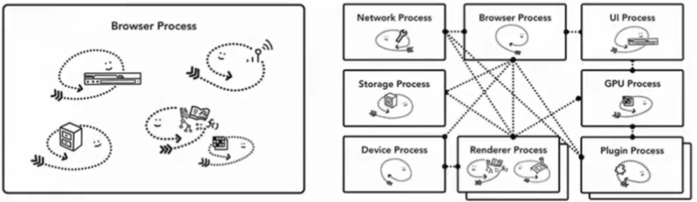
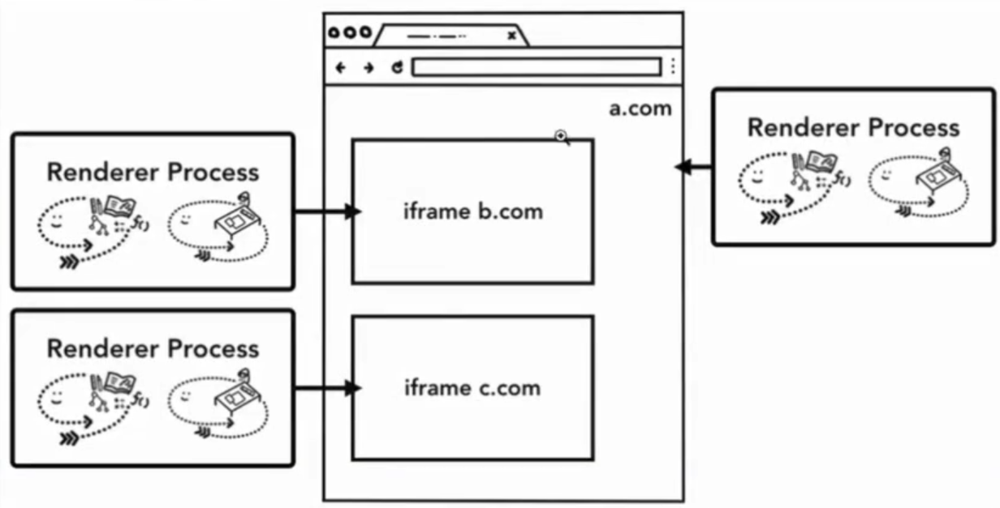
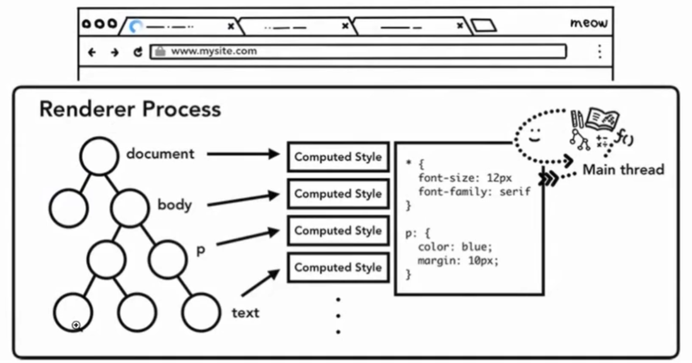

## 浏览器原理

### 操作系统相关

1. CPU

   > 中央处理器, 可以串行地处理任务
   >
   > 每一个核心是独立的 cpu 单元组

2. GPU

   > 图形处理器, 每一个 GPU 的核心只处理一些简单的任务, 但是核心数量非常多, 也就是说并行计算的能力非常强

3. 线程 & 进程

   > 进程 - 可以看作是一个正在运行的应用程序
   >
   > 线程 - 运行在进程里面, 一个进程里会有一个或者多个线程
   >
   > 当启动一个应用程序的时候, 操作系统至少会为其创建一个进程, 还会为这个进程分配一块独立的内存空间, 这块内存存储相关的数据或者状态
   >
   > redis
   >
   > 当关闭应用的时候, 操作系统会把对应的进程给结束掉, 内存空间也会被释放
   >
   > 进程与进程之间, 是相互独立的

### 浏览器架构



Browser(一个) - 浏览器进程, 负责浏览器的主体部分, 包括导航栏, 书签, 前进后退

Network(一个) - 网络进程, 负责页面的网络资源加载

GPU(一个) - 图像渲染进程, 负责渲染

Renderer(多个) - 渲染进程, 负责 tab 内和网页展示的相关工作, 比如将 html, js, css 等资源转换为用户可以与之交互并且看得懂的网页, 默认情况下, 每个 tab 都有一个独立的渲染进程

Plugin(多个) - 插件进程, 每个插件一个进程, flash

Extension(多个) - 扩展程序的进程

### 多进程架构的好处

1. 容错性

   > Chrome 会为每一个 tab 分配一个渲染进程, 其中一个标签页挂掉, 不会影响其他的标签页
   >
   > 其中一个渲染进程挂掉, 不会影响其它的渲染进程

2. 安全性

   > 通过操作系统可以给进程赋予各种权限的原理, 浏览器可以让某些进程不具备特定的功能
   >
   > 比如渲染进程, Chrome限制了它对文件读写的能力

3. 每个进程可以拥有更多的内存

   > 因为进程在分配的时候, 会有一块独立的内存地址空间

### 多进程架构的坏处

内存占用的问题

> 每一个进程都有自己的内存空间
>
> V8 引擎, 是比较基础的东西, 会在每个进程的内存空间中存在

### 多进程架构的内存优化

默认情况下, 每个 tab 都有一个独立的渲染进程.

Chrome的优化是: 限制启动的进程的数量. 当进程的数量到达某个阈值的时候, Chrome 会将访问同一个网站的 tab, 都放在同一个进程里.

- 服务化

  > 主要是针对浏览器进程(Browser Process) 的优化
  >
  > 
  >
  > 高性能的设备上: 浏览器进程(Browser Process) 会被拆分成各种独立进程, 保证了服务的独立性和安全性
  >
  > 一般的设备上: 浏览器进程(Browser Process)

#### 网站隔离

网站隔离会为网站内不同站点的 iframe 分配一个独立的渲染进程

浏览器会为每个 tab 分配一个渲染进程, 但是如果一个 tab 内只有一个渲染进程, 那么它加载的所有 iframe 都会共享内存, 意味着这种共享内存的情况会破坏掉浏览器的同源策略

进程之间的内存空间是绝对相互独立的, 做网站隔离最好的方式其实就是做进程隔离



### 导航的时候发生了什么?

浏览器进程(Browser Process), 负责各种 tab 页之外的东西

1. UI 线程(UI thread): 绘制浏览器顶部按钮和导航栏输入框等组件, 当你在导航栏里输入一些 url 或者关键字的时候, 都是 UI 线程在处理你的输入
2. 存储线程

**高性能设备会独立为 UI 进程和存储进程**

#### 处理输入

UI 线程要做的第一件事情, 就是来确定你输入的是什么类型的内容

1. search words, 会将关键字发送给搜索引擎
2. url, 直接请求你输入的站点资源

#### 开始导航

输入完之后, 按下回车

UI 线程会通知网络进程, 初始化一个网络请求来获取站点的内容

这个时候标签页上的 icon 会展示一个圈圈正在旋转, 网络进程此时会进程各种 DNS 解析以及建立 TLS 连接等操作

-tips: 301 302, 如果网络进程收到服务器的 http 状态码是 301 或者 302, 他会重新通知 UI 线程进行重定向, 然后网络进程会再次发起一个新的网络请求

#### 读取响应

1. 响应类型判断

   > Response-header
   >
   > Content-Type
   >
   > 但是 Content-Type 这个响应头并不一定存在, 浏览器会尝试通过 MIME 类型嗅探的方式来确定响应类型

2. 不同响应类型的处理

   > - html, 浏览器会将获取到的响应数据交给渲染进程, 由渲染进程进行下一步的工作(important)
   > - zip(文件), 响应数据会被交给下载管理器来处理

3. 安全检查

   > 网络进程在把内容交给渲染进程之前, 还会对内容数据做一次安检
   >
   > 如果请求的域名或者响应的内容和某些已知的不安全的网站匹配, 网络进程会给用户展示一个警告页面. Cross Origin Read Block, 保证一些敏感的跨站数据不会被发送给渲染进程

#### 创建一个渲染进程来绘制页面

在网络进程做完所有检查后, 它会告诉 UI 线程所有的数据这边已经准备好了

UI 线程在收到网络进程的反馈后, 会为这个网站来创建一个渲染进程, 来渲染界面

Chrome 在这里有个优化

UI 线程在通知网络进程发起网络请求的时候, 其实是已经直到用户想访问哪个网站了

UI 线程会主动的去寻找或者创建一个渲染进程, 节省了新建渲染进程的时间

- 重定向

UI 线程会废弃掉刚才预创建的渲染进程, 重新给新 url 创建一个渲染进程

#### 提交导航

响应数据

渲染进程

都已经准备完毕了

浏览器进程会通知渲染进程提交本次导航

渲染进程收到命令, 开始提交导航

提交导航完毕后, 渲染进程会通知浏览器进程, 导航已经提交了

浏览器进程收到反馈后, 认为此次导航结束, 开始文档加载阶段

tab 的会话历史, 前进按钮, 后退按钮也会被更新

#### 加载完成

当导航提交完成后, 渲染进程会开始着手加载资源以及渲染页面

load, 渲染进程会通知浏览器进程, 然后 UI 线程停止导航栏上 loading 的圈圈

### 导航到不同的站点

无论导航到什么站点, 能想到的肯定还是有导航的这些所有步骤

beforeunload

浏览器进程会询问渲染进程

带有表单的页面, 你在想刷新或者跳转到其它页面, 或者关掉 tab 的时候, 一般情况下会弹窗一个确认弹窗

- 小问题

  > 问什么浏览器进程需要去问渲染进程, 还有没有收尾工作?
  >
  > 因为当前页面发生的一切, 包括页面内的 js, 都是由渲染进程控制的, 渲染进程内的 js 做了什么, 浏览器进程根本不知道

#### 如果重新发起的导航, 是在页面内发起的?

比如页面内的 js `location.href = xxx`

渲染进程会自己先检查一下有没有注册 beforeunload 事件, 如果没有的话, 渲染进程会向浏览器进程发起一次导航请求

#### 如果重新发起的导航, 是不同的站点呢?

会另起一个渲染进程来完成这次导航, 当前的渲染进程会 unload

### Service Worker 场景下的导航

sw 其实只是运行在渲染进程内的一些 js 代码

导航开始的时候, 浏览器如何判断当前站点有没有对应 sw 缓存

sw 在注册的时候, 会有一个作用域被记录下来

```js
/* index.js */
import './news-article.js';
import {
    topHeadlinesUrl
} from './newsApi.js';

window.addEventListener('load', () => {
    getNews();
    registerSW();
});

async function getNews() {
    const res = await fetch(topHeadlinesUrl);
    const json = await res.json();

    const main = document.querySelector('main');

    json.articles.forEach(article => {
        const el = document.createElement('news-article');
        el.article = article;
        main.appendChild(el);
    });
}

async function registerSW() {
    // 注册 service worker
    if ('serviceWorker' in navigator) {
        try {
            await navigator.serviceWorker.register('./sw.js');
        } catch (e) {
            console.error(e);
        }
    }
}
```

```js
/* sw.js */
const cacheName = 'news-v1';

const staticAssets = [
    './',
    './index.html',
    'styles.css',
    './index.js',
    './newsApi.js',
    './news-article.js'
];

// service worker 缓存
// caches 是一个特殊的 CacheStorage 对象, 能在 service worker 指定的范围内提供数据存储的能力
// 在 sw 使用 web storage 不会有效果
self.addEventListener('install', async (e) => {
    const cache = await caches.open(cacheName);
    await cache.addAll(staticAssets);

    return self.skipWaiting(); // service worker 会直接进入工作, 跳过等待阶段, 即进入 activate 事件
});

self.addEventListener('activate', e => {
    // 更新客户端上的 service worker
    self.clients.claim();
});

self.addEventListener('fetch', async (e) => {
    const req = e.request;
    const url = new URL(req.url);

    if (url.origin === location.origin) {
        e.respondWith(cacheFirst(req));
    } else {
        e.respondWith(networkAndCache(req));
    }
});

async function cacheFirst(req) {
    const cache = await caches.open(cacheName);
    const cached = await cache.match(req);

    return cached || fetch(req);
}

async function networkAndCache(req) {
    const cache = await caches.open(cacheName);
    try {
        const fresh = await fetch(req);
        await cache.put(req, fresh.clone());
        return fresh;
    } catch (e) {
        const cached = await cache.match(req);
        return cached;
    }
}
```


#### 优化

针对没有注册 sw 的情况, 浏览器会执行导航预加载

### 渲染进程中 具体做了什么?

1. 构建 DOM

   > 渲染进程会收到 HTML 数据, 主线程会开始解析收到的文本消息, 将其转化为 dom 对象
   >
   > ```html
   > Hi <b>I`m <i>Chrome</b>!</i>
   > ```
   >
   > ```html
   > Hi <b>I`m <i>Chrome</i></b><i>!</i>
   > ```

2. 子资源加载

   > 除 html 以外的资源, 图片, js, css 等, 会从缓存或者网络上获取

3. js 会阻塞 HTML 的解析过程

   > HTML 解析器在碰到 script 标签的时候, 会停止 html 文档的解析, 转向 js 代码的加载 解析 执行
   >
   > js 中可能包含 `document.write()` , 这样的代码会改变文档流的形状, 也就是改变 document, 会使整个 DOM 对象发生根本性的变化
   >
   > **script 标签 async defer, js 脚本会进行异步加载**
   >
   > `<link rel="preload">` 会告诉浏览器, 当前这个资源肯定会被用到, 请求尽早加载这个资源

#### 样式计算

css

主线程会解析页面的 css 从而确定每个 dom 阶段的计算样式, `getComputedStyle()`, font-size 10rem, 100px

即使你没有自定义的 css, 每个 dom 节点还是会有自己的初始 css



#### 布局

具体过程

1. 主线程会遍历刚刚构建的 DOM 树, 根据 DOM 结点的计算样式计算出一个布局树 layout tree
2. 布局树上每个节点都会有它在页面上的 xy 坐标, 盒子 padding 具体信息. 布局树上只有那些**可见**的 dom 节点信息

如果一个节点设置了 `display: none`, 这个节点就不会出现在布局树上

`visiblity: hidden`, 这个节点还是会出现在布局树上

#### 绘制

绘制顺序

div z-index 1

div z-index 2

div z-index 0, 先绘制这个节点
