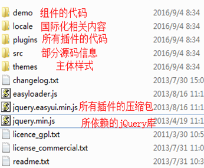
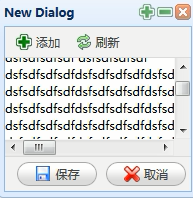
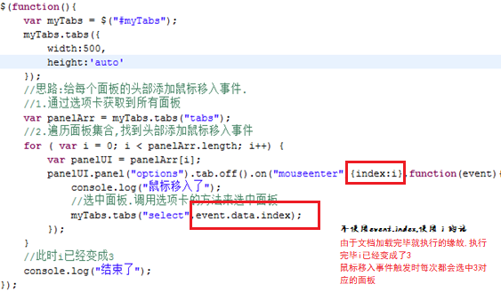
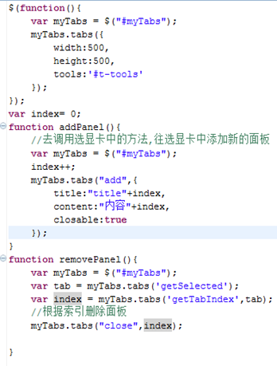

# EasyUI

## 目录结构

01_03



## 创建和配置的方式

01_04,05

**导包**

```html
<!-- 样式文件 -->
<link rel="stylesheet" type="text/css" href="../jquery-easyui/themes/default/easyui.css">
<!--图标样式  -->  
<link rel="stylesheet" type="text/css" href="../jquery-easyui/themes/icon.css">
<!-- jQuery核心库 -->
<script type="text/javascript" src="../jquery-easyui/jquery.min.js"></script>
<!-- EasyUI核心库 -->
<script type="text/javascript" src="../jquery-easyui/jquery.easyui.min.js"></script>
```

**创建**

- 在标签中添加class属性,将标签变成EasyUI的组件

  ```html
  <div class="easyui-panel" data-options="title:'EasyUI面板'" 
       style="width:200px;height:200px;">
      content...
  </div>
  ```

- 通过JS初始化组件(推荐)

  ```html
  <div id="aw" data-options="title:'EasyUI面板'" style="width:200px;height:200px;">
      content...
  </div>
  ```

  ```js
  $(function() {
      $("[[aw]]").panel();
  });
  ```

**属性配置**

- 在标签中使用`data-options='属性名:"属性值"'`

- 直接在标签中配置属性

  ```html
  <div class="easyui-panel" title="EasyUI面板" style="width:200px;height:200px;">
      content...
  </div>
  ```

- 在JS中配置

  ```html
  <div id="aw">content...</div>
  ```

  ```js
  $(function() {
      $("[[aw]]").panel({
          width: 400,//注意不能加'px'
          height: 400,
          title: 'EasyUI面板'
      });
  });
  ```

这三种方式可以混合来用,**js中的配置会把页面中的配置覆盖**

## EasyUI初始化的原理

01_06

1. 页面中扫描`class=”easyui-”`

2. 实现准备好了一大堆的样式文本和样式类

3. 根据判断,到底是什么组件,根据不同的组件添加不同的样式文本和样式类

## 核心 - 属性

01_07

所有的属性都定义在jQuery.fn.{plugin}.defaults里面

> 例如，对话框属性定义在jQuery.fn.dialog.defaults里面
>
> `jQuery.fn.panel.defaults`可以给组件添加默认的配置项

**常用属性**

- title:string 在面板头部显示的标题文本 null 

- iconCls:string 设置一个16x16图标的CSS类ID显示在面板左上角 null 

- width:number 设置面板宽度 auto 

- height:number 设置面板高度 

- headerCls:string 添加一个CSS类ID到面板头部 null 

- bodyCls:string 添加一个CSS类ID到面板正文部分 

- fit:填充父窗体

- content:string 面板主体内容。

- collapsible:boolean 定义是否显示可折叠按钮 false 

- minimizable:boolean 定义是否显示最小化按钮 false 

- maximizable:boolean 定义是否显示最大化按钮 false 

- closable:boolean 定义是否显示关闭按钮

- collapsed:boolean 定义是否在初始化的时候折叠面板

- closed:boolean 定义是否在初始化的时候关闭面板 

- href:从远程加载内容

- cache:boolean 如果为true，在超链接载入时缓存面板内容

- loadingMessage:string 在加载远程数据的时候在面板内显示一条消息 

## 核心 - 事件和方法

01_08

### 事件

所有的事件（回调函数）也都定义在jQuery.fn.{plugin}.defaults里面

fn大多都是以on开头的,大部分复杂组件,都可以在初始化时,使用onxxx属性配置,值为事件响应

> onCollapse 折叠是触发
>
> onExpand  展开时触发

小部分简单组件,还是使用JQuery事件监听方式,使用on方法添加事件

例如linkbutton,没有事件，需要通过jquery的方式去处理

## 方法

调用方法的语法：`$('selector').plugin('method', parameter);`

$(“组件ID”).panel(“open”);

$(“组件ID”).插件名(“方法名”);

## Linkbutton的使用

01_09

**常用的属性**

- plain:boolean 为true时显示简洁效果

- iconCls:string 显示在按钮文字左侧的图标(16x16)的CSS类ID 

## window的使用

01_10

扩展自$.fn.panel.defaults

**常用属性**

- draggable:boolean 定义是否能够拖拽窗口 true 

- resizable:boolean 定义是否能够改变窗口大小 

- **modal:boolean 定义是否将窗体显示为模式化窗口 起遮蔽作用**

## Dialog的使用

01_11

扩展自$.fn.window.defaults



**对话框上的按钮**

- 工具栏按钮 tools
- 顶部按钮 toolbar
- 底部按钮 buttons

**按钮定义方式**

- array数组

  ```js
  $("[[myDialog]]").dialog({
      width: 600,
      height: 400,
      tools: [//定义工具栏按钮,处于右上角
          {
              iconCls: 'icon-add',
              handler: function() {
                  alert('add');
              }
          }, {
              iconCls: 'icon-edit',
              handler: function() {
                  alert('edit');
              }
          }
      ],
      buttons: [//定义底部按钮,位于底部
          {
              text: '保存',
              iconCls: 'icon-save',
              handler: function() {
                  alert('save');
              }
          }, {
              text: '取消',
              iconCls: 'icon-cancel',
              handler: function() {
                  $('[[myDialog]]').dialog('close');
              }
          }
      ]
  });
  ```

- selector选择器定义

  ```html
  <div id="myDialog">
      <div id="tt">
          <a class="icon-add" onclick="alert('add');"></a>
          <a class="icon-edit" onclick="alert('edit');"></a>
      </div>
  </div>
  ```

  ```js
  $("[[myDialog]]").dialog({
      width: 600,
      height: 400,
      tools: "[[tt]]"
  });
  ```


## Tabs的使用

01_12

**鼠标移入就选中选项卡**



**动态添加面板**


