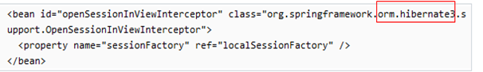
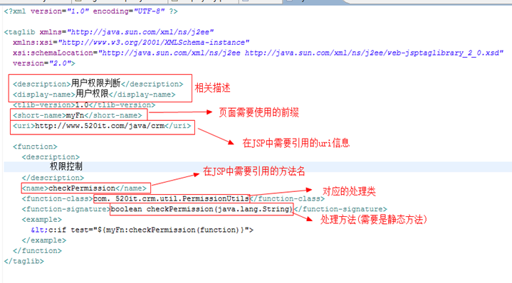
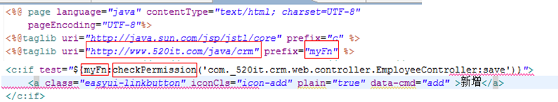

# CRM

## 框架整合_1

### pom.xml

```xml
<dependencies>
    <dependency>
        <groupId>junit</groupId>
        <artifactId>junit</artifactId>
        <version>3.8.1</version>
        <scope>test</scope>
    </dependency>
    <dependency>
        <groupId>org.projectlombok</groupId>
        <artifactId>lombok</artifactId>
        <version>1.16.6</version>
    </dependency>
    <!-- servlet-api -->
    <dependency>
        <groupId>javax.servlet</groupId>
        <artifactId>servlet-api</artifactId>
        <version>2.5</version>
        <scope>provided</scope>
    </dependency>

    <dependency>
        <groupId>mysql</groupId>
        <artifactId>mysql-connector-java</artifactId>
        <version>5.1.21</version>
    </dependency>

    <!-- druid -->
    <dependency>
        <groupId>com.alibaba</groupId>
        <artifactId>druid</artifactId>
        <version>1.0.14</version>
    </dependency>

    <!-- common-lang -->
    <dependency>
        <groupId>commons-lang</groupId>
        <artifactId>commons-lang</artifactId>
        <version>2.6</version>
    </dependency>

    <!-- spring -->
    <dependency>
        <groupId>org.springframework</groupId>
        <artifactId>spring-test</artifactId>
        <version>${org.springframework.version}</version>
        <scope>test</scope>
    </dependency>
    <dependency>
        <groupId>org.springframework</groupId>
        <artifactId>spring-core</artifactId>
        <version>${org.springframework.version}</version>
    </dependency>
    <dependency>
        <groupId>org.springframework</groupId>
        <artifactId>spring-context</artifactId>
        <version>${org.springframework.version}</version>
    </dependency>
    <dependency>
        <groupId>org.springframework</groupId>
        <artifactId>spring-context-support</artifactId>
        <version>${org.springframework.version}</version>
    </dependency>
    <dependency>
        <groupId>org.springframework</groupId>
        <artifactId>spring-expression</artifactId>
        <version>${org.springframework.version}</version>
    </dependency>
    <dependency>
        <groupId>org.springframework</groupId>
        <artifactId>spring-jdbc</artifactId>
        <version>${org.springframework.version}</version>
    </dependency>
    <dependency>
        <groupId>org.springframework</groupId>
        <artifactId>spring-tx</artifactId>
        <version>${org.springframework.version}</version>
    </dependency>
    <dependency>
        <groupId>org.springframework</groupId>
        <artifactId>spring-web</artifactId>
        <version>${org.springframework.version}</version>
    </dependency>
    <dependency>
        <groupId>org.springframework</groupId>
        <artifactId>spring-aop</artifactId>
        <version>${org.springframework.version}</version>
    </dependency>
    <dependency>
        <groupId>org.springframework</groupId>
        <artifactId>spring-webmvc</artifactId>
        <version>${org.springframework.version}</version>
    </dependency>

    <!-- aspectj -->
    <dependency>
        <groupId>org.aspectj</groupId>
        <artifactId>aspectjrt</artifactId>
        <version>1.7.4</version>
    </dependency>

    <dependency>
        <groupId>org.aspectj</groupId>
        <artifactId>aspectjweaver</artifactId>
        <version>1.7.4</version>
    </dependency>

    <!-- cglib -->
    <dependency>
        <groupId>cglib</groupId>
        <artifactId>cglib</artifactId>
        <version>3.1</version>
    </dependency>

    <!-- mybatis -->
    <dependency>
        <groupId>org.mybatis</groupId>
        <artifactId>mybatis</artifactId>
        <version>${org.mybatis.version}</version>
    </dependency>

    <dependency>
        <groupId>org.mybatis</groupId>
        <artifactId>mybatis-spring</artifactId>
        <version>1.2.3</version>
    </dependency>

    <!-- json -->
    <dependency>
        <groupId>com.fasterxml.jackson.core</groupId>
        <artifactId>jackson-core</artifactId>
        <version>2.5.0</version>
    </dependency>
    <dependency>
        <groupId>com.fasterxml.jackson.core</groupId>
        <artifactId>jackson-databind</artifactId>
        <version>2.5.0</version>
    </dependency>
    <dependency>
        <groupId>com.fasterxml.jackson.core</groupId>
        <artifactId>jackson-annotations</artifactId>
        <version>2.5.0</version>
    </dependency>

    <dependency>
        <groupId>org.slf4j</groupId>
        <artifactId>slf4j-api</artifactId>
        <version>1.7.6</version>
    </dependency>

    <dependency>
        <groupId>org.slf4j</groupId>
        <artifactId>slf4j-log4j12</artifactId>
        <version>1.7.6</version>
    </dependency>
    <dependency>
        <groupId>log4j</groupId>
        <artifactId>log4j</artifactId>
        <version>1.2.17</version>
    </dependency>

    <dependency>
        <groupId>commons-fileupload</groupId>
        <artifactId>commons-fileupload</artifactId>
        <version>1.3.1</version>
    </dependency>

    <!-- jstl -->
    <dependency>
        <groupId>jstl</groupId>
        <artifactId>jstl</artifactId>
        <version>1.2</version>
    </dependency>
    <!-- standard -->
    <dependency>
        <groupId>taglibs</groupId>
        <artifactId>standard</artifactId>
        <version>1.1.2</version>
    </dependency>

    <dependency>
        <groupId>org.freemarker</groupId>
        <artifactId>freemarker</artifactId>
        <version>2.3.20</version>
    </dependency>
    <dependency>
        <groupId>dom4j</groupId>
        <artifactId>dom4j</artifactId>
        <version>1.6.1</version>
    </dependency>
</dependencies>
<build>
    <finalName>CRM0615</finalName>
    <plugins>
        <plugin>
            <groupId>org.mybatis.generator</groupId>
            <artifactId>mybatis-generator-maven-plugin</artifactId>
            <version>1.3.2</version>
            <configuration>
                <verbose>true</verbose>
                <overwrite>false</overwrite>
            </configuration>
            <dependencies>
                <dependency>
                    <groupId>mysql</groupId>
                    <artifactId>mysql-connector-java</artifactId>
                    <version>5.1.21</version>
                </dependency>
            </dependencies>
        </plugin>
        <plugin>
            <groupId>org.apache.maven.plugins</groupId>
            <artifactId>maven-compiler-plugin</artifactId>
            <configuration>
                <source>1.7</source>
                <target>1.7</target>
            </configuration>
        </plugin>
        <!-- 添加一个tomcat插件 -->
        <plugin>
            <groupId>org.apache.tomcat.maven</groupId>
            <artifactId>tomcat7-maven-plugin</artifactId>
            <version>2.2</version>
            <configuration>
                <!-- tomcat启动的端口 -->
                <port>80</port>
                <!-- 应用的上下文路径 -->
                <path>/</path>
            </configuration>
        </plugin>
    </plugins>
</build>
```

### mybatis-config.xml

```xml
<?xml version="1.0" encoding="UTF-8"?>
<!DOCTYPE configuration
  PUBLIC "-//mybatis.org//DTD Config 3.0//EN"
  "http://mybatis.org/dtd/mybatis-3-config.dtd">
<configuration>
    <settings>
        <setting name="lazyLoadingEnabled" value="true"/>
        <setting name="aggressiveLazyLoading" value="false"/>
        <setting name="lazyLoadTriggerMethods" value="equals,clone,hashCode"/>
    </settings>
</configuration>
```

### db.properties

```properties
db.driverClaassName=com.mysql.jdbc.Driver
db.url=jdbc:mysql:///mybatis
db.userName=root
db.password=
```

### application.xml

```xml
<?xml version="1.0" encoding="UTF-8"?>
<beans xmlns="http://www.springframework.org/schema/beans"
       xmlns:xsi="http://www.w3.org/2001/XMLSchema-instance" xmlns:p="http://www.springframework.org/schema/p"
       xmlns:context="http://www.springframework.org/schema/context"
       xmlns:aop="http://www.springframework.org/schema/aop" xmlns:jee="http://www.springframework.org/schema/jee"
       xmlns:tx="http://www.springframework.org/schema/tx"
       xsi:schemaLocation="
                           http://www.springframework.org/schema/beans http://www.springframework.org/schema/beans/spring-beans.xsd
                           http://www.springframework.org/schema/context http://www.springframework.org/schema/context/spring-context.xsd
                           http://www.springframework.org/schema/jee http://www.springframework.org/schema/jee/spring-jee.xsd
                           http://www.springframework.org/schema/aop http://www.springframework.org/schema/aop/spring-aop.xsd
                           http://www.springframework.org/schema/tx http://www.springframework.org/schema/tx/spring-tx.xsd">
    <!-- 注解扫描 -->
    <context:component-scan base-package="main" />

    <!-- 导入外部文件db.properties -->
    <context:property-placeholder location="classpath:db.properties" />

    <!-- 配置数据源 -->
    <bean id="dataSource" class="com.alibaba.druid.pool.DruidDataSource" 
          init-method="init" destroy-method="close">
        <property name="driverClassName" value="${db.driverClassName}" />
        <property name="url" value="${db.url}" />
        <property name="username" value="${db.username}" />
        <property name="password" value="${db.password}" />
    </bean>

    <!-- 配置SessionFactory -->
    <bean id="sessionFactory" class="org.mybatis.spring.SqlSessionFactoryBean">
        <property name="dataSource" ref="dataSource"/>
        <!-- 扫描mybatis的主配置文件 -->
        <property name="configLocation" value="classpath:mybatis-config.xml"/>
        <!-- 扫描po包,使用别名 -->
        <property name="typeAliasesPackage" value="main.domain"></property>
        <!-- 扫描映射文件 -->
        <property name="mapperLocations">
            <array>
                <value>classpath:config/mybatis/mapper/admin/*.xml</value>
                <value>classpath:config/mybatis/mapper/*.xml</value>
            </array>
        </property>
    </bean>

    <!-- 配置事务管理器 -->
    <bean id="transactionManager"
          class="org.springframework.jdbc.datasource.DataSourceTransactionManager">
        <property name="dataSource" ref="dataSource"></property>
    </bean>

    <!-- 配置事务模板 -->
    <!-- 后续加入日志模块需要更改read-only和propagation -->
    <tx:advice id="advice" transaction-manager="txManager">
        <tx:attributes>
            <tx:method name="get*" read-only="true"/>
            <tx:method name="query*" read-only="true"/>
            <tx:method name="list*" read-only="true"/>
            <tx:method name="*" propagation="REQUIRED"/>
        </tx:attributes>
    </tx:advice>

    <!-- AOP切面配置 -->
    <aop:config>
        <aop:pointcut expression="execution(* main.service.*Service.*.*(..))" 
                      id="pointcut"/>
        <!-- 建立和when,切入点的联系 -->
        <aop:advisor advice-ref="advice" pointcut-ref="pointcut"/>
    </aop:config>

    <!-- 定义service,mapper -->
    <bean id="userMapper" class="org.mybatis.spring.mapper.MapperFactoryBean">
        <property name="mapperInterface" value="main.mapper.UserMapper"/>
    </bean>
    <bean id="userService" class="main.service.UserService">
        <property name="userMapper" ref="userMapper"/>
    </bean>
</beans>

```

## 框架整合_2

### generatorConfig.xml

DAO层和domain代码,以及mapper文件根据数据库自动生成

> 右键项目
>
> run as,mvn build
>
> Name: keyGen
>
> Goals: mybatis-generator:generate
>
> run
>
> <font color=red>**注意: 没办法自动生成many,one的映射,需要去修改**</font>

```xml
<?xml version="1.0" encoding="UTF-8"?>
<!DOCTYPE generatorConfiguration
  PUBLIC "-//mybatis.org//DTD MyBatis Generator Configuration 1.0//EN"
"http://mybatis.org/dtd/mybatis-generator-config_1_0.dtd">
<!-- 配置生成器 -->
<generatorConfiguration>

	<context id="mysql" defaultModelType="hierarchical"
		targetRuntime="MyBatis3Simple">

		<!-- 自动识别数据库关键字，默认false，如果设置为true，根据SqlReservedWords中定义的关键字列表； 一般保留默认值，遇到数据库关键字（Java关键字），使用columnOverride覆盖 -->
		<property name="autoDelimitKeywords" value="false" />
		<!-- 生成的Java文件的编码 -->
		<property name="javaFileEncoding" value="UTF-8" />
		<!-- 格式化java代码 -->
		<property name="javaFormatter"
			value="org.mybatis.generator.api.dom.DefaultJavaFormatter" />
		<!-- 格式化XML代码 -->
		<property name="xmlFormatter"
			value="org.mybatis.generator.api.dom.DefaultXmlFormatter" />

		<!-- beginningDelimiter和endingDelimiter：指明数据库的用于标记数据库对象名的符号，比如ORACLE就是双引号，MYSQL默认是`反引号； -->
		<property name="beginningDelimiter" value="`" />
		<property name="endingDelimiter" value="`" />

		<commentGenerator>
			<property name="suppressDate" value="true" />
			<property name="suppressAllComments" value="true" />
		</commentGenerator>

		<!-- 必须要有的，使用这个配置链接数据库 @TODO:是否可以扩展 -->
		<jdbcConnection driverClass="com.mysql.jdbc.Driver"
			connectionURL="jdbc:mysql:///crm0615" userId="root" password="">
			<!-- 这里面可以设置property属性，每一个property属性都设置到配置的Driver上 -->
		</jdbcConnection>

		<!-- java类型处理器 用于处理DB中的类型到Java中的类型，默认使用JavaTypeResolverDefaultImpl； 注意一点，默认会先尝试使用Integer，Long，Short等来对应DECIMAL和 
			NUMERIC数据类型； -->
		<javaTypeResolver
			type="org.mybatis.generator.internal.types.JavaTypeResolverDefaultImpl">
			<!-- true：使用BigDecimal对应DECIMAL和 NUMERIC数据类型 false：默认, scale>0;length>18：使用BigDecimal; 
				scale=0;length[10,18]：使用Long； scale=0;length[5,9]：使用Integer； scale=0;length<5：使用Short； -->
			<property name="forceBigDecimals" value="false" />
		</javaTypeResolver>


		<!-- java模型创建器，是必须要的元素 负责：1，key类（见context的defaultModelType）；2，java类；3，查询类 
			targetPackage：生成的类要放的包，真实的包受enableSubPackages属性控制； targetProject：目标项目，指定一个存在的目录下，生成的内容会放到指定目录中，如果目录不存在，MBG不会自动建目录 -->
		<javaModelGenerator targetPackage="aw.domain"
			targetProject="src/main/java">
			<!-- for MyBatis3/MyBatis3Simple 自动为每一个生成的类创建一个构造方法，构造方法包含了所有的field；而不是使用setter； -->
			<property name="constructorBased" value="false" />

			<!-- for MyBatis3 / MyBatis3Simple 是否创建一个不可变的类，如果为true， 那么MBG会创建一个没有setter方法的类，取而代之的是类似constructorBased的类 -->
			<property name="immutable" value="false" />

			<!-- 设置是否在getter方法中，对String类型字段调用trim()方法 -->
			<property name="trimStrings" value="true" />
		</javaModelGenerator>

		<!-- 生成SQL map的XML文件生成器， 注意，在Mybatis3之后，我们可以使用mapper.xml文件+Mapper接口（或者不用mapper接口）， 
			或者只使用Mapper接口+Annotation，所以，如果 javaClientGenerator配置中配置了需要生成XML的话，这个元素就必须配置 
			targetPackage/targetProject:同javaModelGenerator -->
		<sqlMapGenerator targetPackage="aw.mapper"
			targetProject="src/main/java">
			<!-- 在targetPackage的基础上，根据数据库的schema再生成一层package，最终生成的类放在这个package下，默认为false -->
			<property name="enableSubPackages" value="true" />
		</sqlMapGenerator>


		<!-- 对于mybatis来说，即生成Mapper接口，注意，如果没有配置该元素，那么默认不会生成Mapper接口 targetPackage/targetProject:同javaModelGenerator 
			type：选择怎么生成mapper接口（在MyBatis3/MyBatis3Simple下）： 1，ANNOTATEDMAPPER：会生成使用Mapper接口+Annotation的方式创建（SQL生成在annotation中），不会生成对应的XML； 
			2，MIXEDMAPPER：使用混合配置，会生成Mapper接口，并适当添加合适的Annotation，但是XML会生成在XML中； 3，XMLMAPPER：会生成Mapper接口，接口完全依赖XML； 
			注意，如果context是MyBatis3Simple：只支持ANNOTATEDMAPPER和XMLMAPPER -->
		<javaClientGenerator targetPackage="aw.mapper"
			type="XMLMAPPER" targetProject="src/main/java">
			<!-- 在targetPackage的基础上，根据数据库的schema再生成一层package，最终生成的类放在这个package下，默认为false -->
			<property name="enableSubPackages" value="true" />

			<!-- 可以为所有生成的接口添加一个父接口，但是MBG只负责生成，不负责检查 <property name="rootInterface" 
				value=""/> -->
		</javaClientGenerator>

		<table tableName="employee">
			<!-- 参考 javaModelGenerator 的 constructorBased属性 -->
			<property name="constructorBased" value="false" />
			<generatedKey column="id" sqlStatement="JDBC" />
		</table>
	</context>
</generatorConfiguration>
```

### 高级查询 + 分页

**IUserService.java**

```java
public interface IUserService {
    public PageResult list(QueryObject qo);
}
```

**PageResult.java**

```java
@NoArguments @AllArguments
@Getter @Setter
public class PageResult {
    private Long total;
    private List rows;
    
    public static final PageResult EMPTY = new PageResult(0L,Collections.emptyList());
}
```

**QueryObject.java**

```java
@Getter @Setter
public class QueryObject {
    private Long currentPage;
    private Long pageSize;
    private String keyword;
    private Integer beginAge;
    private Integer endAge;
    
    public Long getStart() {
        return (this.currentPage - 1) * this.pageSize;
    }
}
```

**UserServiceImpl**

```java
public class UserServiceImpl implements IUserService {
    @Autowired
    private EmployeeMapper dao;

    @Override
    public PageResult list(QueryObject qo) {
        Long count = dao.selectByConditionCount(qo);
        if (count > 0) {
            List<User> result = mapper.selectByCondition(qo);
            return new PageResult(count, result);
        } else {
            return PageResult.EMPTY;
        }
    }
}
```

**UserMapper.xml**

```xml
<sql id="condition">
    <where>
        <if test="keyword!=null">
            username like '%${keyword}%'
        </if>
        <if test="beginAge!=null">
            AND age &gt;= #{beginAge}
        </if>
        <if test="endAge!=null">
            AND age &lt;= #{endAge}
        </if>
    </where>
</sql>

<select id="selectByConditionCount" parameterType="main.query.QueryObject" 
        resultType="long">
    select count(*) from employee
	<include refid="condition"></include>
</select>

<select id="selectByCondition" parameterType="main.query.QueryObject" 
        resultType="User">
    select * from employee
	<include refid="condition"></include>
    limit #{start},#{pageSize}
</select>
```

## 框架整合_4

### application-mvc.xml

```xml
<?xml version="1.0" encoding="UTF-8"?>
<beans xmlns="http://www.springframework.org/schema/beans"
       xmlns:xsi="http://www.w3.org/2001/XMLSchema-instance"
       xmlns:context="http://www.springframework.org/schema/context"
       xmlns:mvc="http://www.springframework.org/schema/mvc"
       xmlns:aop="http://www.springframework.org/schema/aop"
       xmlns:task="http://www.springframework.org/schema/task"
       xsi:schemaLocation="http://www.springframework.org/schema/mvc 
                           http://www.springframework.org/schema/mvc/spring-mvc-4.2.xsd
                           http://www.springframework.org/schema/beans 
                           http://www.springframework.org/schema/beans/spring-beans-4.2.xsd
                           http://www.springframework.org/schema/context 
                           http://www.springframework.org/schema/context/spring-context-4.2.xsd
                           http://www.springframework.org/schema/aop 
                           http://www.springframework.org/schema/aop/spring-aop-4.2.xsd
                           http://www.springframework.org/schema/task 
                           http://www.springframework.org/schema/task/spring-task-3.2.xsd">

    <!-- 注解扫描 -->
    <context:component-scan base-package="main.controller">
        <context:include-filter type="annotation"
                                expression="org.springframework.stereotype.Controller"/>
    </context:component-scan>

    <!-- 注解驱动支持 -->
    <mvc:annotation-driven></mvc:annotation-driven>

    <!-- 对静态资源处理 -->
    <mvc:default-servlet-handler />

    <!-- 配置视图解析器 -->
    <bean class="org.springframework.web.servlet.view.InternalResourceViewResolver">
        <property name="prefix" value="/WEB-INF/views/"></property>
        <property name="suffix" value=".jsp"></property>
    </bean>

    <!-- 引入其他文件 -->
    <import resource="classpath:application.xml"/>

    <mvc:interceptors>
        <!-- 后台访问拦截器 -->
        <mvc:interceptor>
            <mvc:mapping path="/admin/**" />
            <mvc:mapping path="/system/*" />
            <mvc:exclude-mapping path="/system/login" />
            <mvc:exclude-mapping path="/system/get_cpacha" />
            <mvc:exclude-mapping path="/resources/**" />
            <bean class="main.interceptor.admin.LoginInterceptor"></bean>
        </mvc:interceptor>
        <!-- 前台访问拦截器 -->
        <mvc:interceptor>
            <mvc:mapping path="/home/center/**"/>
            <bean class="main.interceptor.home.LoginInterceptor"></bean>
        </mvc:interceptor>
    </mvc:interceptors>
</beans>
```

### web.xml

```xml
<servlet>
    <servlet-name>springMVC</servlet-name>
    <servlet-class>org.springframework.web.servlet.DispatcherServlet</servlet-class>
    <init-param>
        <param-name>contextConfigLocation</param-name>
        <param-value>classpath:application-mvc.xml</param-value>
    </init-param>
    <!-- 启动的优先级,数字越小,优先级越高 -->
    <load-on-startup>1</load-on-startup>
</servlet>
<servlet-mapping>
    <servlet-name>springMVC</servlet-name>
    <url-pattern>/</url-pattern>
</servlet-mapping>

<!-- 字符编码过滤器 -->
<filter>
    <filter-name>CharacterEncoding</filter-name>
    <filter-class>org.springframework.web.filter.CharacterEncodingFilter</filter-class>
    <init-param>
        <param-name>encoding</param-name>
        <param-value>UTF-8</param-value>
    </init-param>
    <init-param>
        <param-name>forceEncoding</param-name>
        <param-value>true</param-value>
    </init-param>
</filter>
<filter-mapping>
    <filter-name>CharacterEncoding</filter-name>
    <url-pattern>/*</url-pattern>
</filter-mapping>
```

## 登录拦截

```java
public class LoginInterceptor implements HandlerInterceptor {
    @Override
    public void afterCompletion(HttpServletRequest arg0,
                                HttpServletResponse arg1, Object arg2, Exception arg3)
        throws Exception {
        // TODO Auto-generated method stub
    }

    @Override
    public void postHandle(HttpServletRequest arg0, HttpServletResponse arg1,
                           Object arg2, ModelAndView arg3) throws Exception {
        // TODO Auto-generated method stub
    }

    @Override
    public boolean preHandle(HttpServletRequest request, HttpServletResponse response,
                             Object handler) throws Exception {
        Employee user = (Employee)request.getSession().getAttribute("userInSession");
        if(user == null){
            /*String header = request.getHeader("X-Requested-With");
            //判断是否是ajax请求
            if("XMLHttpRequest".equals(header)){
                //表示是ajax请求
                Map<String, String> ret = new HashMap<String, String>();
                ret.put("type", "error");
                ret.put("msg", "登录会话超时或还未登录，请重新登录!");
                response.getWriter().write(JSONObject.fromObject(ret).toString());
                return false;
            }*/
            response.sendRedirect("/login.jsp");
            return false;
        }
        return true;
    }
}
```

**application-mvc.xml**

```xml
<mvc:interceptor>
    <mvc:mapping path="/*" />
    <mvc:exclude-mapping path="/login" />
    <mvc:exclude-mapping path="/resources/**" />
    <bean class="main.interceptor.LoginInterceptor"></bean>
</mvc:interceptor>
```

## 常见问题

### AutoWeird可以注入serviceimpl类吗

因为配置了事务切面,所以只能注入service接口

```xml
<!-- AOP切面配置 -->
<aop:config>
    <aop:pointcut expression="execution(* main.service.*Service.*.*(..))" 
                  id="pointcut"/>
    <!-- 建立和when,切入点的联系 -->
    <aop:advisor advice-ref="advice" pointcut-ref="pointcut"/>
</aop:config>
```

## 前后台代码优化

### 前台

**将所有JS中的业务方法放入一个`cmdObj`中,调用其的按钮上添加`data-cmd`属性**

便于查看和管理

```js
//统一添加事件
$("a[data-cmd]").on("click", function() {
 var cmd = $(this).data("cmd");
 if (cmd)
     cmdObj["cmd"]();
});
```

**JS中多次用到的`$("[[employee_datagrid]]")`用变量保存起来**

因为每次调用$选择器都会扫描整个文档

**封装后台传递给前台的`data{ "success": true, "msg": ""}`**

```java
@Getter @Setter
public class AjaxReslut {
    private boolean success;
    private String msg;

    public AjaxResult(boolean success, String msg) {
        this.success = success;
        this.msg = msg;
    }

    public AjaxResult(String msg) {
        this.success = false;
        this.msg = msg;
    }
}
```

## 其他补充

### 更新前预处理(参照Struts2的PreparedSaveOrUpdate方法)

1,去数据库中把对应的ID的对象查询出来

2.把这个对象封装前台过来的参数

3.把这个对象注入到update方法中

```java
@ModelAttribute
public void before(Long id, Model model) {
    if (id != null) {//说明是更新操作
        Employee emp = employeeService.get(id);
        model.addAttribute(emp);
    }
}
```

该Controller中的所有方法执行前都会先执行添加`@ModelAttribute`的before方法

### OpenSessionInView(重要?)

在没有使用Spring提供的Open Session In View情况下，因需要在service(or Dao)层里把session关闭，所以lazy loading 为true的话，要在应用层内把关系集合都初始化，如 company.getEmployees()，否则Hibernate抛session already closed Exception;  

Open Session In View提供了一种简便的方法，较好地解决了lazy loading问题.   

它有两种配置方式OpenSessionInViewInterceptor和OpenSessionInViewFilter(具体参看 SpringSide)，功能相同，只是一个在web.xml配置，另一个在application.xml配置而已。
Open Session In View在request把session绑定到当前thread期间一直保持hibernate session在open状态，使session在request的整个期间都可以使用，如在View层里PO也可以lazy loading数据，如 ${ company.employees }。当View 层逻辑完成后，才会通过Filter的doFilter方法或Interceptor的postHandle方法自动关闭session。

> 如果使用**SpringMVC**+Hibernate(JPA)
>
> **就不能使用openSessionInViewFilter**
>
> **需要使用openSessionInViewInterceptor**
>
> 

## 基于AOP的日志管理

### 创建LogUtil.java

```java
public class LogUtil {
    @AutoWired
    private ISystemLogService systemLogService;
    
    /* 会帮我们传递一个切入点 */
    public void writeLog(JoinPoint joinPoint) throws Exception {
        Object target = joinPoint.getTarget();//目标对象
        //如果是日志service,放行
		if (target instanceof ISystemLogService)
            return;
        SystemLog log = new SystemLog();
        log.setOptime(new Date());
        HttpServletRequest request = UserContext.get();
        Employee emp = (Employee)request
            .getSession().getAttribute(UserContext.USER_IN_SESSION);
        log.setOpuser(emp);
        log.setOpip(request.getRemoteAddr());

        Signature signature = joinPoint.getSignature();//方法签名
        String function = target.getClass().getName() + ":" + signature.getName();
        log.setFunction(function);

        ObjectMapper mapper = new ObjectMapper();
        mapper.setSerializationInclusion(Include.NON_NULL);//去除空参数
        String params = mapper.writeValueAsString(joinPoint.getArgs());//将参数转成json字符串
		log.setParams(params);
    }
}
```

### application.xml中添加AOP

```xml
<!-- AOP切面配置 -->
<aop:config>
    <aop:aspect ref="logUtil">
        <aop:after method="writeLog" pointcut="execution(* main.service.*Service.*.*(..))"/>
    </aop:aspect>
</aop:config>

<bean id="logUtil" class="main.util.LogUtil"></bean>
```

### 创建日志表和domain,mapper

|    数据项    |   字段   |    输入格式    | 是否必填 |
| :----------: | :------: | :------------: | :------: |
|      ID      |    id    | 数据库自动生成 |          |
|   操作用户   |  opUser  |    用户对象    |    是    |
|   操作时间   |  opTime  |      文本      |    是    |
|    登录IP    |   opIp   |      文本      |          |
|   使用功能   | function |      文本      |          |
| 操作参数信息 |  params  |      文本      |          |

```java
@Getter @Setter
@Alias("SystemoutLog")
public class SystemLog {
    private Long id;
    private Employee opuser;
    private Date optime;
    private String opip;
    private String function;
    private String params;
}
```

### ThreadLocal\<HttpServletRequest> - 为使用session,把Session绑定到线程中

相当于Hibernate中的getCurrentSession();

```java
private static ThreadLocal<HttpServletRequest> local = new ThreadLocal<HttpServletRequest>();

private static void set(HttpServletRequest request) {
    local.set(request);
}
public static HttpServletRequest get() {
    return local.get();
}
```

### 同时在登录拦截器中加入

```java
public boolean preHandle(HttpServletRequest request, HttpServletResponse response,
                         Object handler) throws Exception {
    /* 绑定到线程中 */
    UserContext.set(request);
    Employee user = (Employee)request.getSession().getAttribute("userInSession");
    if(user == null){
        response.sendRedirect("/login.jsp");
        return false;
    }
    return true;
}
```

### 更改application.xml中的事务模板

保存日志到数据库,使用当前事务,但`get*`,`query*`,`list*`没有开启事务

```xml
<tx:advice id="advice" transaction-manager="txManager">
    <tx:attributes>
        <tx:method name="get*" read-only="true" propagation="SUPPROTS"/>
        <tx:method name="query*" read-only="true" propagation="SUPPROTS"/>
        <tx:method name="list*" read-only="true" propagation="SUPPROTS"/>
        <tx:method name="*" propagation="REQUIRED"/>
    </tx:attributes>
</tx:advice>
```

## 前台集合传参

onsubmit的时候拼接

permission[0].id= 1;

permission[1].id= 2;

## ajax默认发送异步请求

```js
//回显数据
var html = $.ajax({
    url: "/role_queryRoleIdByEId?eid=" + rowData.id;
    async: false
}).responseText;//获取员工的角色,json字符串
html = $.parseJSON(html);//解析json字符串,转换成数组
$("[[employee_roleCombo]]").combobox('setValues', html);
```

## URL权限控制

创建PermissionUtils工具类检验权限表达式

**静态属性注入**在**set方法**上添加@AutoWired

**获取用户权限**

- 登陆的时候查询出该用户的所有权限,放入session

  > 优点:不需要频繁访问数据库
  >
  >  缺点:及时性不高

- 每次都去数据库中查询

  > 优点:及时性强,安全性高
  >
  > 缺点:需要频繁访问数据库

```java
@Component
public class PermissionUtils {
    private static IPermissionService permissionService;

    @AutoWired
    public setPermissionService(IPermissionService permissionService) {
        PermissionUtils.permissionService = permissionService;
    }

    public static boolean checkPermission(String exp) {
        Session session = UserContext.get().getsession();
        Employee user = (Employee)session.getAttribute(UserContext.USER_IN_SESSION);
        if (user.getAdmin())
            return true;
        //查询权限表,查看是否需要权限控制
        Permission p = permissionService.queryByResource(exp);
        if (p != null) {
            //需要权限控制
            //获取用户权限
            List<Permission> ps = (List<Permission>)UserContext
                .get()
                .getsession()
                .getAttribute(UserContext.PERMISSION_IN_SESSION);
            String allexp = exp.split(":")[0] + ":" + "All";
            for (Permission p : ps) {
                if (p.getResource().equals(exp) || p.getResource().equals(allexp))
                    return true;
            }
            return false;
        } else {
            return true;
        }
    }
}
```

## 按钮权限控制 - 自定义标签

### 导包

jstl.jar

standard.jar

### 在WEB-INF下新建tld目录,新建myFn.tld文件



### 在页面中引用tld文件,使用方法



## Excel的导出

**导入jxl的依赖jar**

```xml
<dependency>
    <groupId>net.sourceforge.jexcelapi</groupId>
    <artifactId>jxl</artifactId>
    <version>2.6.12</version>
</dependency>
```

**基本操作方式**

```java
@Test
public void testExcel() throws Exception {
    //1.建立Excel工作的对象
    WritableWorkbook wb = Workbook.createWorkbook(new File("out.xls"));
    //2.创建sheet页
    WritableSheet sheet = wb.createSheet("第一个sheet页", 0);
    
    //定义宽高
    sheet.setColumnView(0, 50);
    sheet.setRowView(0, 500);
    
    //合并单元格(左上列,左上行,右下列,右下行),默认取左上角单元的内容
    sheet.merge(0, 0, 3, 3);
    
    //单元格格式化对象,设置水平居中,垂直居中
    WritableCellFormat st = new WritableCellFormat();
    st.setAlignment(Alignment.CENTER);
    st.setVerticaltAlignment(VerticaltAlignment.CENTER);
    
    //3.创建单元格(列,行,内容)
    Label cell = new Label(0, 0, "我的第一个单元格",st);
    //4.往sheet页中添加单元格信息
    sheet.addCell(cell);
    //5.将内容写出去
    wb.write();
    //6.关闭资源
    wb.close();
}
```

**日期类型**

```java
@Test
public void testDate() throws Exception {
    //1.建立Excel工作的对象
    WritableWorkbook wb = Workbook.createWorkbook(new File("outDate.xls"));
    //2.创建sheet页
    WritableSheet sheet = wb.createSheet("第一个sheet页", 0);
    
    jxl.write.DateFormat format = new jxl.write.DateFormat("yyyy-MM-dd hh:mm:ss");
    WritableCellFormat st = new WritableCellFormat(format);
    //3.创建单元格(列,行,内容)
    DateTime cell = new DateTime(0, 0, new Date(), st);
    //4.往sheet页中添加单元格信息
    sheet.addCell(cell);
    //5.将内容写出去
    wb.write();
    //6.关闭资源
    wb.close();
}
```

## Excel的读取

```java
@Test
public void testRead() throws Exception {
    //1.获取工作本对象
    Workbook.getWorkbook(new File("read.xls"));
    //2.获取sheet页信息
    Sheet sheet = wb.getSheet(0);
    //3.获取行列信息
    int rows = sheet.getRows();
    int cols = sheet.getColumns();
    
    for (int i = 0; i < rows; i++) {
        for (int j = 0; j < cols; j++) {
            Cell cell = sheet.getCell(j, i);
            System.out.println(cell.getContents() + "\t");
        }
        System.out.println();
    }
    wb.close();
}
```

## 拦截器中判断请求页面还是ajax

对于静态资源,handler对应的类为DefaultServletHttpRequestHandler,此事不需要做URL权限控制

当handler是HandlerMethod类型的对象,此时才需要访问控制器的方法,此时才需要URL权限控制

```java
@Override
public boolean preHandle(HttpServletRequest request, 
                         HttpServletResponse response, 
                         Object handler) throws Exception {
    if (handler instanceof HandlerMethod) {
        HandlerMethod handlerMethod = (HandlerMethod)handler;
        Method method = handlerMethod.getMethod();
        if (method.isAnnotationPresent(ResponseBody.class)) {
            response.sendRedirect("noPermission.json");
        } else {
            response.sendRedirect("noPermission.jsp");
        }
    }
    return true;
}
```

